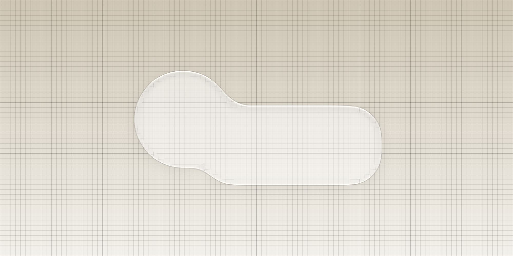
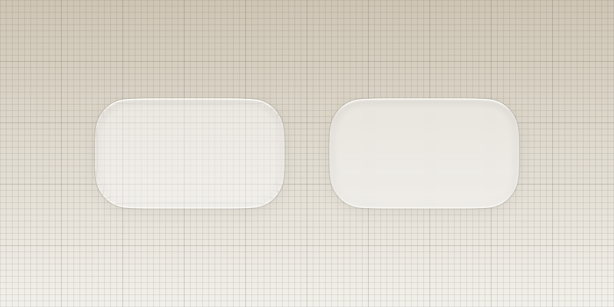
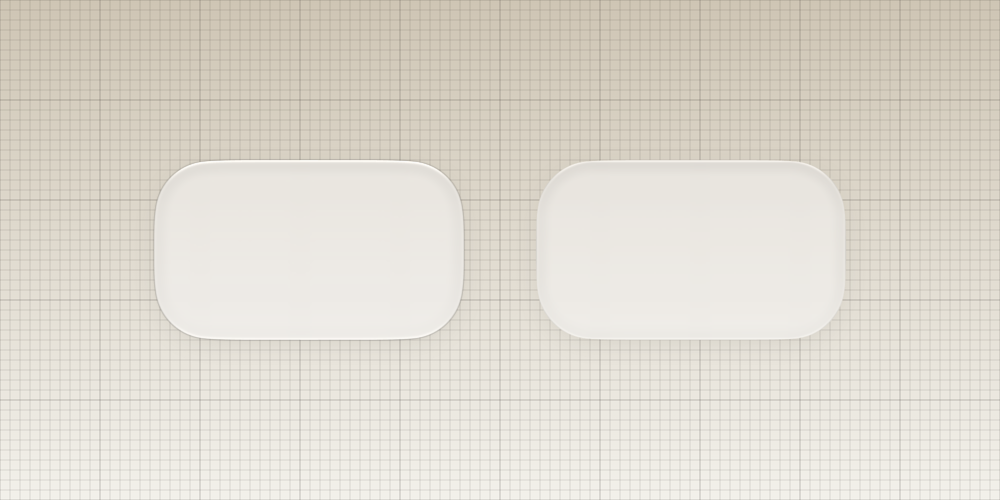

# Liquid Glass Renderer

<!-- [](./test/) -->
[](https://pub.dev/packages/liquid_glass_renderer)
[](./test/)
[![lints by lintervention][lintervention_badge]][lintervention_link]


> ## ⚠️ **EXPERIMENTAL PRE-RELEASE**
>
> This package is not battle-tested and should not yet be treated as
> production-ready. Its full renderer depends on Impeller and Flutter GPU,
> which is itself still a beta API. Expect rendering behavior and package APIs
> to change while both mature. Unsupported renderer paths automatically use
> `FakeGlass`.
> 
> **Before deploying to production:**
> - Read [Limitations](#limitations) and [Performance](#performance).
> - Verify that the full renderer is active where refraction is required.
> - Profile representative screens on physical target devices.
> - Treat `FakeGlass` as a narrower compatibility fallback and profile the
>   exact screen; its simpler path can be faster, but that is workload-dependent.


A Flutter renderer for iOS 27-style liquid glass, with configurable refraction,
frost, lighting, contours, shadows, and blended geometry. It reproduces the
visual language in Flutter; it is not an implementation of Apple's private
material or rendering APIs.


The image above is generated by `test/src/docs_snapshot_test.dart`, keeping the
published artwork tied to executable renderer code.

## Features

-   🫧 **Implement Glass Effects**: Easily wrap any widget to give it a glass effect.
-   🔀 **Blended Geometry**: Merge nearby shapes into one continuous glass surface.
-   🎨 **Highly Customizable**: Adjust thickness, color tint, lighting, and more.
-   🔍 **Background Effects**: Apply background blur and refraction.
-   ✨ **Interactive Glow**: Add touch-responsive glow effects to glass surfaces.
-   🔲 **Shadows**: Paint shape-aware exterior shadows below the glass surface.
-   🎭 **Fake Glass**: Portable, no-refraction fallback for renderers without Flutter GPU shader support.
-   🤸 **Stretch Effects**: Apply organic squash and stretch animations to glass widgets.

## Installation

This prerelease requires Flutter 3.47 or newer.

Install via `flutter pub add`:

```sh
flutter pub add liquid_glass_renderer
```

And import it in your Dart code:

```dart
import 'package:liquid_glass_renderer/liquid_glass_renderer.dart';
```

## How To Use

The liquid glass effect is achieved by taking the pixels of the content *behind* the glass widget and distorting them. For the effect to be visible, you **must** place your glass widget on top of other content. The easiest way to do this is with a `Stack`.

Read [Performance](#performance) before tuning a production screen.

```dart
Stack(
  children: [
    // 1. Your background content goes here
    MyBackgroundContent(),

    // 2. Create a layer for liquid glass effects
    LiquidGlassLayer(
      // 3. Add your LiquidGlass widgets here
      child: LiquidGlass(
        shape: LiquidRoundedSuperellipse(borderRadius: 30),
        child: const SizedBox.square(dimension: 100),
      ),
    ),
  ],
)
```

### What's in the box?

This package provides several widgets to create the glass effect:

| Widget                    | Use Case                                                                                   |
| ------------------------- | ------------------------------------------------------------------------------------------ |
| `LiquidGlassLayer`        | Owns settings and rendering for the glass shapes registered below it.                      |
| `LiquidGlass`             | Adds one shape to the nearest `LiquidGlassLayer`.                                           |
| `LiquidGlass.auto`        | Automatically uses a parent `LiquidGlassLayer` if available, or creates its own.           |
| `LiquidGlassBlendGroup`   | Groups multiple `LiquidGlass.grouped` shapes to blend them together seamlessly.            |
| `FakeGlass`               | Portable no-refraction fallback with a simpler material shader. Profile representative screens. |
| `GlassGlow`               | Add touch-responsive glow effects to glass surfaces.                                       |
| `LiquidStretch`           | Add interactive squash and stretch effects to glass widgets.                               |

## Limitations

The current prerelease has three important boundaries:

- **Full refraction requires Impeller and Flutter GPU.** When that path is not
  available, `LiquidGlassLayer` automatically renders `FakeGlass`, which keeps
  frost, tint, lighting, contours, and shadows but omits optical refraction.
- **Android, iOS, and macOS are the release-tested platforms.** Other Flutter
  targets are not part of the current prerelease validation matrix.
- **A `LiquidGlassLayer` supports up to 16 shapes.** Split more complex scenes
  across multiple layers.

## Performance

The full effect has two distinct costs: an SDF geometry texture that is cached
while shapes are unchanged, and a clipped backdrop/refraction pass over the
visible glass pixels. In device testing, backdrop blur is usually the most
expensive material feature because it filters and samples a large pixel area.
`FakeGlass` skips geometry encoding and refraction, but still pays for backdrop
blur, tint, lighting, shadows, and Flutter compositing. In repeated matched
toolbar measurements on a Pixel 10, it reduced raster p95 by 20.8%, total-frame
p95 by 17.0%, and PSS by 3.9% versus the full renderer. That is evidence for
that scene rather than a universal promise: blur area, overlap, animation, and
device GPU can change the result. See the
[measurement report](example/tool/PR152_PIXEL10_COMPARISON.md).

The renderer caches static geometry and clips the final material pass to its
paint bounds. Actual cost still depends on covered pixels, frost, animation,
overlap, device GPU, and Flutter's compositing decisions; widget count alone is
not a useful predictor. Measure the screen you intend to ship in a profile
build on physical hardware.

Practical controls with predictable impact:

- **Frost is usually the largest cost.** It performs backdrop blur over the
  filtered area. Reduce `frost` or glass coverage first when tuning a screen.
- **Changing shape geometry invalidates its cached SDF.** Static geometry and
  transforms that do not alter the shape can reuse cached renderer state.
- **Large soft shadows process more pixels.** Keep blur radii proportional to
  the control rather than to the full screen.
- **Profile `FakeGlass` independently.** It removes refraction and uses a
  simpler material shader, but retains backdrop blur and compositing.

---

## Examples

### `LiquidGlass`: A Single Glass Shape

To create glass shapes, you must wrap them in a `LiquidGlassLayer`. This layer manages the rendering of all glass effects within it.

```dart
import 'package:flutter/material.dart';
import 'package:liquid_glass_renderer/liquid_glass_renderer.dart';

class MyGlassWidget extends StatelessWidget {
  @override
  Widget build(BuildContext context) {
    return Scaffold(
      backgroundColor: Colors.white,
      body: Stack(
        children: [
          // This is the content that will be behind the glass
          Positioned.fill(
            child: Image.network(
              'https://picsum.photos/seed/glass/800/800',
              fit: BoxFit.cover,
            ),
          ),
          // The LiquidGlassLayer manages glass rendering
          Center(
            child: LiquidGlassLayer(
              settings: const LiquidGlassSettings(
                thickness: 20,
                frost: 10,
                tint: Color(0x33FFFFFF),
              ),
              child: LiquidGlass(
                shape: LiquidRoundedSuperellipse(
                  borderRadius: 50,
                ),
                child: const SizedBox(
                  height: 200,
                  width: 200,
                  child: Center(
                    child: FlutterLogo(size: 100),
                  ),
                ),
              ),
            ),
          ),
        ],
      ),
    );
  }
}
```

If you need a single glass shape with custom settings and don't want to create a separate `LiquidGlassLayer`, you can use `LiquidGlass.withOwnLayer`:

```dart
LiquidGlass.withOwnLayer(
  settings: const LiquidGlassSettings(
    thickness: 15,
    frost: 8,
  ),
  shape: LiquidRoundedSuperellipse(borderRadius: 30),
  child: const SizedBox.square(dimension: 100),
)
```

If you don't know whether a `LiquidGlassLayer` exists as an ancestor, use `LiquidGlass.auto`. It will render on a parent layer if one is found, or create its own layer otherwise:

```dart
LiquidGlass.auto(
  settings: const LiquidGlassSettings(
    thickness: 15,
    frost: 8,
  ),
  shape: LiquidRoundedSuperellipse(borderRadius: 30),
  child: const SizedBox.square(dimension: 100),
)
```

The `settings` and `fake` parameters are only used as a fallback when no parent layer is present. When a parent layer exists, its settings take precedence.

#### Supported Shapes

The LiquidGlass widget supports the following shapes:

-   `LiquidRoundedSuperellipse` (recommended) - A smooth, rounded squircle shape
-   `LiquidOval` - A perfect ellipse/circle
-   `LiquidRoundedRectangle` - A rounded rectangle

Rounded shapes take a single `double` for `borderRadius`; non-uniform corner
radii are not supported.


### `LiquidGlassBlendGroup`: Blending Multiple Shapes

To blend multiple glass shapes together seamlessly, wrap them in a `LiquidGlassBlendGroup` inside a `LiquidGlassLayer`. Use `LiquidGlass.grouped()` for shapes that should blend together.



The SDF combines grouped shapes into one continuous refractive contour; the
shadow remains outside that shared surface.

```dart
LiquidGlassLayer(
  settings: const LiquidGlassSettings(
    thickness: 20,
    frost: 10,
  ),
  child: LiquidGlassBlendGroup(
    blend: 20.0, // Controls how much shapes blend together
    child: Column(
      mainAxisAlignment: MainAxisAlignment.center,
      children: [
        LiquidGlass.grouped(
          shape: LiquidRoundedSuperellipse(
            borderRadius: 40,
          ),
          child: const SizedBox.square(dimension: 100),
        ),
        const SizedBox(height: 50),
        LiquidGlass.grouped(
          shape: LiquidRoundedSuperellipse(
            borderRadius: 40,
          ),
          child: const SizedBox.square(dimension: 100),
        ),
      ],
    ),
  ),
)
```

You can have multiple `LiquidGlass` widgets in a `LiquidGlassLayer` without blending by using the default `LiquidGlass()` constructor (not `.grouped()`).

## Customization

### `LiquidGlassSettings`

You can customize the appearance of the glass by providing `LiquidGlassSettings` to a `LiquidGlassLayer`, `LiquidGlass.withOwnLayer()`, or `LiquidGlass.auto()`. All glass widgets within that layer will share these settings.

For the closest validated match to the iOS 27 toolbar material, select the
size-specific preset for the current appearance and tune it for your control:

```dart
const LiquidGlassSettings.ios27ToolbarLight()
const LiquidGlassSettings.ios27ToolbarDark()
```

These presets are deliberately not universal defaults. Apple's material varies
with control size and appearance; these fits target a toolbar-sized capsule.

```dart
final brightness = MediaQuery.platformBrightnessOf(context);

LiquidGlassLayer(
  settings: LiquidGlassSettings.ios27Toolbar(brightness: brightness),
  child: LiquidGlassBlendGroup(
    blend: 40, // blend is now on LiquidGlassBlendGroup, not settings
    child: // ... your LiquidGlass.grouped widgets
  ),
)
```

`ios27Toolbar` selects the independently fitted light or dark transmission
curve. It does not derive dark appearance by inverting or recoloring the light
material.

Here's a breakdown of the key settings:

-   `visibility`: Scales the material toward its inactive state.
-   `tint`: Unified material tint; alpha controls transmission.
-   `thickness`: Optical profile depth in logical pixels.
-   `edgeRefraction`: Peak edge displacement in pixels.
-   `refractionSpread`: Extends the SDF optical profile into the face without magnifying the backdrop.
-   `backdropScale`: Scales the deep-face backdrop while fading to identity at the refractive contour (`< 1` reveals more content; `> 1` magnifies).
-   `frost`: Background softening strength (0 = no blur).
-   `chromaticAberration`: Wavelength separation at the refracted edge.
-   `highlight`, `highlightWidth`, `highlightWrap`, `highlightOppositeStrength`: Paired directional edge lighting.
-   `curvatureLighting`: Additional contour-normal lighting response.
-   `contourStrength`, `contourWidth`, `contourOffset`, `contourTransmittance`: SDF-derived dielectric outline.
-   `bevelShadowStrength`, `bevelShadowDepth`, `bevelShadowOffset`, `bevelShadowDirectionality`: Inner bevel shading.
-   `bevelShadowSizeResponse`: Optional size response for inner bevel shading.
-   `exteriorShadowSizeResponse`: Optional size response for caller-provided shadows.
-   `transmissionGamma`, `vibrancy`, `saturation`: Display transfer and color response.

Geometry blending is configured on `LiquidGlassBlendGroup`, not in
`LiquidGlassSettings`.

Increasing saturation when using colored glass helps achieve an Apple-like aesthetic.

Keep `backdropScale` close to `1` for subtle material treatments. Values above
`1` enlarge pixels from the already-captured backdrop and therefore lose
detail. For a loupe or other strong magnification, paint the higher-resolution
view first with Flutter's `RawMagnifier`, then apply ordinary liquid glass so
its edge refraction and lighting remain crisp.

### Adding Blur

You can apply a background blur using the `frost` property in `LiquidGlassSettings`. This is independent of the glass refraction effect.



The left study keeps the backdrop clear so refraction stays legible. The right
uses the same material with frost, softening the captured backdrop rather than
changing the shape.

```dart
LiquidGlassLayer(
  settings: const LiquidGlassSettings(
    frost: 10.0,
    thickness: 20,
  ),
  child: // ... your glass widgets
)
```


### Child Placement

The `child` of a `LiquidGlass` widget can be rendered either "inside" the glass or on top of it using the `glassContainsChild` property.

-   `glassContainsChild: false` (default): The child is rendered normally on top of the glass effect.
-   `glassContainsChild: true`: The child is part of the glass, affected by color tint and refraction.

### Shadows

Add exterior shadows with the `shadows` parameter. The renderer paints supported
shapes with matching canvas primitives and keeps the shadow pass outside the
clipped refraction pass.

`BoxShadow.blurStyle` is ignored; the renderer always produces an
outer-equivalent shadow. Non-zero offsets are supported and the glass shape is
cut out of the composed shadow so it does not show through the translucent
surface.

```dart
LiquidGlass(
  shape: LiquidRoundedSuperellipse(borderRadius: 30),
  shadows: const [
    BoxShadow(
      color: Color(0x24000000),
      offset: Offset(0, 6),
      blurRadius: 20,
    ),
  ],
  child: const SizedBox.square(dimension: 150),
)
```

Shadows work with all `LiquidGlass` constructors (`.grouped()`, `.withOwnLayer()`, `.auto()`), as well as `FakeGlass`.

### `FakeGlass`: Portable Fallback

Use `FakeGlass` when Flutter GPU shader filters are unavailable, or when you
intentionally need a portable no-refraction path. It preserves the material's
blur, tint, lighting, contour, and shadow. Its analytic per-shape material
shader is simpler than the full refraction pipeline, but backdrop blur remains
the dominant cost in many scenes, so measure it on target hardware.



Full liquid glass is shown on the left and `FakeGlass` on the right. Both are
rendered from the same settings; the fallback omits the refractive optics.

```dart
FakeGlass(
  shape: LiquidRoundedSuperellipse(
    borderRadius: 20,
  ),
  settings: const LiquidGlassSettings(
    frost: 10,
    tint: Color(0x33FFFFFF),
  ),
  child: const SizedBox(
    height: 100,
    width: 100,
    child: Center(child: Text('Fallback Glass')),
  ),
)
```

Alternatively, you can enable fake glass for an entire layer:

```dart
LiquidGlassLayer(
  fake: true,
  settings: const LiquidGlassSettings(
    frost: 10,
    tint: Color(0x33FFFFFF),
  ),
  child: // ... your glass widgets will automatically use FakeGlass
)
```

`FakeGlass` does not perform optical displacement or dispersion. The fallback
ignores `edgeRefraction`, `refractionSpread`, `backdropScale`,
`chromaticAberration`, `transmissionGamma`, `vibrancy`, and
`curvatureLighting`.

### `GlassGlow`: Interactive Touch Effects

Add responsive glow effects that follow user touches. Wrap your content with `GlassGlow` inside your glass widget. The `GlassGlowLayer` is automatically included by `LiquidGlass`.

```dart
LiquidGlassLayer(
  child: LiquidGlass(
    shape: LiquidRoundedSuperellipse(
      borderRadius: 20,
    ),
    child: GlassGlow(
      glowColor: Colors.white24,
      glowRadius: 1.0,
      child: const SizedBox(
        height: 100,
        width: 100,
        child: Center(child: Text('Touch Me')),
      ),
    ),
  ),
)
```

The glow effect automatically appears at touch locations and fades out smoothly when interaction ends.

### `LiquidStretch`: Organic Squash and Stretch

Add interactive squash and stretch effects that respond to user gestures, creating an organic, jelly-like feel:

```dart
LiquidStretch(
  stretch: 0.5,
  interactionScale: 1.05,
  child: LiquidGlass(
    shape: LiquidRoundedSuperellipse(
      borderRadius: 20,
    ),
    child: const SizedBox(
      height: 100,
      width: 100,
      child: Center(child: Text('Stretchy')),
    ),
  ),
)
```

The widget listens to drag gestures and applies smooth squash and stretch transformations without interfering with other gestures.


For more details, check out the API documentation in the source code.

---

[lintervention_link]: https://github.com/whynotmake-it/lintervention
[lintervention_badge]: https://img.shields.io/badge/lints_by-lintervention-3A5A40
