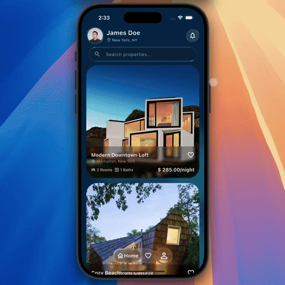
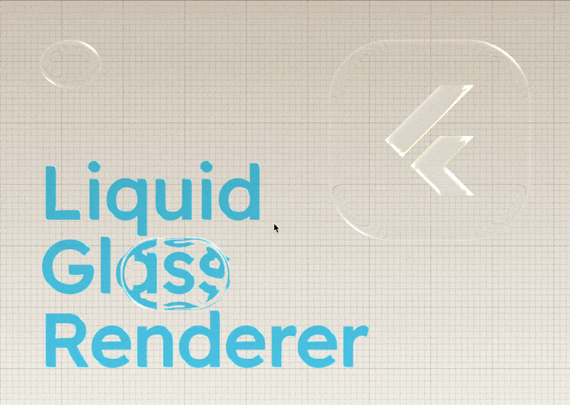
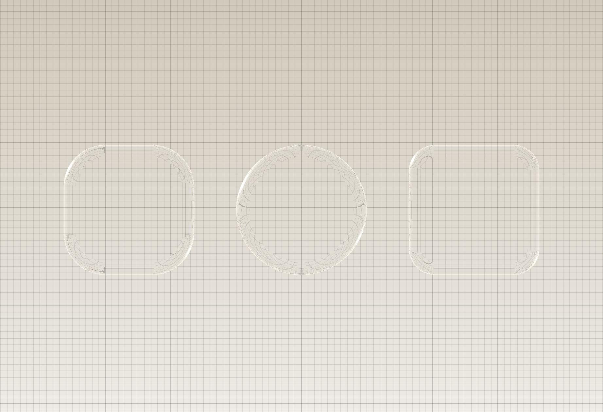
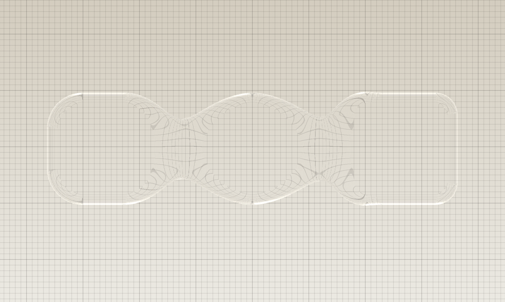

# Liquid Glass Renderer

<!-- [](./test/) -->
[](https://pub.dev/packages/liquid_glass_renderer)
[](./test/)
[![lints by lintervention][lintervention_badge]][lintervention_link]


> ## ⚠️ **EXPERIMENTAL - USE WITH CAUTION**
>
> **This package is still experimental and should not be blindly added to production apps for all devices.** While performance has improved significantly, liquid glass effects in Flutter are computationally intensive due to the limited access to the GPU and may not perform well on all hardware configurations. 
> 
> **Before deploying to production:**
> - **Take a look at the [Limitations](#limitations) and [Performance](#-a-word-on-performance) sections** before even thinking about using this package in production.
> - **Make sure your App is built on Impeller**. Skia is unsupported for now
> - **Test thoroughly on your target devices**, especially lower-end and mid-range devices
> - **Monitor performance metrics** (memory usage, frame rates, power consumption, jank)
> - **Use `FakeGlass` strategically**: Swap out `LiquidGlass` widgets with `FakeGlass` when they're not highly visible, off-screen, or have low visual impact
>
> **We need your feedback!** Please test on your devices and report performance characteristics, issues, and suggestions.


A Flutter package for creating a stunning "liquid glass" or "frosted glass" effect. This package allows you to transform your widgets into beautiful, customizable glass-like surfaces that can blend and interact with each other.




## Features

-   🫧 **Implement Glass Effects**: Easily wrap any widget to give it a glass effect.
-   🔀 **Blending Layers**: Create layers where multiple glass shapes can blend together like liquid.
-   🎨 **Highly Customizable**: Adjust thickness, color tint, lighting, and more.
-   🔍 **Background Effects**: Apply background blur and refraction.
-   ✨ **Interactive Glow**: Add touch-responsive glow effects to glass surfaces.
-   🔲 **Shadows**: Add performant `BoxShadow`s to glass shapes using optimized canvas primitives.
-   🎭 **Fake Glass**: Lightweight glass appearance without expensive shaders for better performance.
-   🤸 **Stretch Effects**: Apply organic squash and stretch animations to glass widgets.

## Installation

**In order to start using Flutter Liquid Glass you must have the [Flutter SDK][flutter_install_link] installed on your machine.**

Install via `flutter pub add`:

```sh
flutter pub add liquid_glass_renderer
```

And import it in your Dart code:

```dart
import 'package:liquid_glass_renderer/liquid_glass_renderer.dart';
```

## How To Use



The liquid glass effect is achieved by taking the pixels of the content *behind* the glass widget and distorting them. For the effect to be visible, you **must** place your glass widget on top of other content. The easiest way to do this is with a `Stack`.

Make sure to read the [Performance](#-a-word-on-performance) section for tips on getting the best performance out of the package.

```dart
Stack(
  children: [
    // 1. Your background content goes here
    MyBackgroundContent(),

    // 2. Create a layer for liquid glass effects
    LiquidGlassLayer(
      // 3. Add your LiquidGlass widgets here
      child: LiquidGlass(
        shape: LiquidRoundedSuperellipse(borderRadius: 30),
        child: const SizedBox.square(dimension: 100),
      ),
    ),
  ],
)
```

### What's in the box?

This package provides several widgets to create the glass effect:

| Widget                    | Use Case                                                                                   |
| ------------------------- | ------------------------------------------------------------------------------------------ |
| `LiquidGlassLayer`        | Container for all liquid glass effects. Required parent for `LiquidGlass` widgets.         |
| `LiquidGlass`             | Creates a single glass shape. Must be inside a `LiquidGlassLayer`.                         |
| `LiquidGlass.auto`        | Automatically uses a parent `LiquidGlassLayer` if available, or creates its own.           |
| `LiquidGlassBlendGroup`   | Groups multiple `LiquidGlass.grouped` shapes to blend them together seamlessly.            |
| `FakeGlass`               | Lightweight glass appearance without refraction. Better performance, less visual fidelity. |
| `GlassGlow`               | Add touch-responsive glow effects to glass surfaces.                                       |
| `LiquidStretch`           | Add interactive squash and stretch effects to glass widgets.                               |

### ⚠️ Limitations

As this is a pre-release, there are a few things to keep in mind:

- **Full refraction requires Impeller and Flutter GPU.** On Skia, or when Flutter GPU is unavailable, `LiquidGlassLayer` automatically renders its `FakeGlass` fallback and logs that decision in debug builds.
- **Animated geometry is still expensive.** Geometry textures are retained and reused to avoid allocation spikes, but changing shape size or relative position requires another Flutter-GPU geometry pass.
- **Maximum of 16 shapes** can be blended in a `LiquidGlassBlendGroup`, and performance will degrade significantly with the more shapes you add in the same group.


### 🚨 A word on Performance

The liquid glass effect is computationally intensive, especially on mobile devices. To save GPU cycles, `liquid_glass_renderer` will try to cache geometry in textures wherever possible.

#### Memory Usage
Geometry render targets grow in 64-physical-pixel buckets and retain their high-water size for the layer's lifetime; these mattes are small, and replacing them during transforms caused large delayed native-memory spikes. Larger Impeller backdrop-filter bounds use non-retaining 64-pixel buckets so their saveLayer targets can be reused without permanently keeping the largest AABB. This is selected internally rather than exposed as a consumer mode. Use the benchmark harness in `example/tool` to validate memory on representative hardware.

#### Best Practices
To ensure the best performance when using liquid glass effects, consider the following tips:
- **Put sibling glass in one `LiquidGlassLayer`.** That is one backdrop sample. `LiquidGlass.withOwnLayer` is for glass that sits on other glass, or that needs different settings.
- **Place a layer around chrome.** `LiquidGlass.auto` joins a parent layer when one exists. A tab bar or toolbar should wrap its items in one `LiquidGlassLayer` so they share that sample. Without a parent, each `auto` widget creates its own layer.
- **Use `LiquidGlassBlendGroup` only when shapes should morph into each other.** Standalone shapes on the same layer do not blend and do not allocate extra filters.
- **Do not split sparse shapes into many layers.** Sparse shapes in one layer cost about the same as a tight group. Extra layers each allocate their own filter state.
- **Limit the number of blended shapes**: Each additional shape in a `LiquidGlassBlendGroup` increases the computational load. Try to keep the number of blended shapes low (maximum 16).
- **Limit geometry animations**: Static geometry is cached. Moving an entire `LiquidGlassLayer` as one unit reuses its matte, but moving or resizing shapes relative to their layer forces geometry to be rendered again. In a `LiquidGlassBlendGroup`, moving one shape rebuilds the group.
- **Share backdrop captures for non-overlapping independent layers**: Wrap related layers in a Flutter `BackdropGroup` and set `useBackdropGroup: true`, or supply an explicit `BackdropKey`. This shares the capture, not per-layer filter state, and is separate from `LiquidGlassBlendGroup`.

---

## Examples

### `LiquidGlass`: A Single Glass Shape



To create glass shapes, you must wrap them in a `LiquidGlassLayer`. This layer manages the rendering of all glass effects within it.

```dart
import 'package:flutter/material.dart';
import 'package:liquid_glass_renderer/liquid_glass_renderer.dart';

class MyGlassWidget extends StatelessWidget {
  @override
  Widget build(BuildContext context) {
    return Scaffold(
      backgroundColor: Colors.white,
      body: Stack(
        children: [
          // This is the content that will be behind the glass
          Positioned.fill(
            child: Image.network(
              'https://picsum.photos/seed/glass/800/800',
              fit: BoxFit.cover,
            ),
          ),
          // The LiquidGlassLayer manages glass rendering
          Center(
            child: LiquidGlassLayer(
              settings: const LiquidGlassSettings(
                thickness: 20,
                blur: 10,
                glassColor: Color(0x33FFFFFF),
              ),
              child: LiquidGlass(
                shape: LiquidRoundedSuperellipse(
                  borderRadius: 50,
                ),
                child: const SizedBox(
                  height: 200,
                  width: 200,
                  child: Center(
                    child: FlutterLogo(size: 100),
                  ),
                ),
              ),
            ),
          ),
        ],
      ),
    );
  }
}
```

If you need a single glass shape with custom settings and don't want to create a separate `LiquidGlassLayer`, you can use `LiquidGlass.withOwnLayer`:

```dart
LiquidGlass.withOwnLayer(
  settings: const LiquidGlassSettings(
    thickness: 15,
    blur: 8,
  ),
  shape: LiquidRoundedSuperellipse(borderRadius: 30),
  child: const SizedBox.square(dimension: 100),
)
```

If you don't know whether a `LiquidGlassLayer` exists as an ancestor, use `LiquidGlass.auto`. It will render on a parent layer if one is found, or create its own layer otherwise:

```dart
LiquidGlass.auto(
  settings: const LiquidGlassSettings(
    thickness: 15,
    blur: 8,
  ),
  shape: LiquidRoundedSuperellipse(borderRadius: 30),
  child: const SizedBox.square(dimension: 100),
)
```

The `settings` and `fake` parameters are only used as a fallback when no parent layer is present. When a parent layer exists, its settings take precedence.

**Note:** Make sure you have read the [Performance](#-a-word-on-performance) section for tips on getting the best performance out of the package.

#### Supported Shapes

The LiquidGlass widget supports the following shapes:

-   `LiquidRoundedSuperellipse` (recommended) - A smooth, rounded squircle shape
-   `LiquidOval` - A perfect ellipse/circle
-   `LiquidRoundedRectangle` - A rounded rectangle

All shapes take a simple `double` for `borderRadius` instead of `BorderRadius` or `Radius`, since they don't support non-uniform radii.


### `LiquidGlassBlendGroup`: Blending Multiple Shapes



To blend multiple glass shapes together seamlessly, wrap them in a `LiquidGlassBlendGroup` inside a `LiquidGlassLayer`. Use `LiquidGlass.grouped()` for shapes that should blend together.

```dart
LiquidGlassLayer(
  settings: const LiquidGlassSettings(
    thickness: 20,
    blur: 10,
  ),
  child: LiquidGlassBlendGroup(
    blend: 20.0, // Controls how much shapes blend together
    child: Column(
      mainAxisAlignment: MainAxisAlignment.center,
      children: [
        LiquidGlass.grouped(
          shape: LiquidRoundedSuperellipse(
            borderRadius: 40,
          ),
          child: const SizedBox.square(dimension: 100),
        ),
        const SizedBox(height: 50),
        LiquidGlass.grouped(
          shape: LiquidRoundedSuperellipse(
            borderRadius: 40,
          ),
          child: const SizedBox.square(dimension: 100),
        ),
      ],
    ),
  ),
)
```

You can have multiple `LiquidGlass` widgets in a `LiquidGlassLayer` without blending by using the default `LiquidGlass()` constructor (not `.grouped()`).

## Customization

### `LiquidGlassSettings`

You can customize the appearance of the glass by providing `LiquidGlassSettings` to a `LiquidGlassLayer`, `LiquidGlass.withOwnLayer()`, or `LiquidGlass.auto()`. All glass widgets within that layer will share these settings.

```dart
LiquidGlassLayer(
  settings: const LiquidGlassSettings(
    thickness: 10,
    glassColor: Color(0x1AFFFFFF),
    lightIntensity: 1.5,
    edgeColor: Color(0x66000000),
    edgeWidth: 1,
    saturation: 1.2,
  ),
  child: LiquidGlassBlendGroup(
    blend: 40, // blend is now on LiquidGlassBlendGroup, not settings
    child: // ... your LiquidGlass.grouped widgets
  ),
)
```

Here's a breakdown of the key settings:

-   `glassColor`: The color tint of the glass. The alpha channel controls the intensity.
-   `thickness`: How much the glass refracts the background (higher = more distortion).
-   `blur`: Background blur strength (0 = no blur).
-   `refractiveIndex`: The refractive index of the glass material (1.0 = no refraction, ~1.5 = realistic glass).
-   `lightAngle`, `lightIntensity`: Control the direction and brightness of the virtual light source, creating highlights.
-   `ambientStrength`: The intensity of ambient light on the glass.
-   `highlightColor`, `edgeColor`, `edgeWidth`, `edgeInset`, `specularWrap`, and `bleedStrength`: Control the lit rim and outline.
-   `saturation`: Adjusts the color saturation of background pixels visible through the glass (1.0 = no change, <1.0 = desaturated, >1.0 = more saturated).

**Note:** The `blend` parameter has been moved from `LiquidGlassSettings` to the `LiquidGlassBlendGroup` constructor, as it specifically controls shape blending behavior.

Increasing saturation when using colored glass helps achieve an Apple-like aesthetic.

### Adding Blur

You can apply a background blur using the `blur` property in `LiquidGlassSettings`. This is independent of the glass refraction effect.

```dart
LiquidGlassLayer(
  settings: const LiquidGlassSettings(
    blur: 10.0,
    thickness: 20,
  ),
  child: // ... your glass widgets
)
```

### Sharing backdrop captures

Backdrop capture is independent from liquid shape blending.
`LiquidGlassBlendGroup` controls how geometry merges; Flutter's
`BackdropGroup` controls whether non-overlapping filters can reuse one capture.

```dart
final key = BackdropKey();

BackdropGroup(
  backdropKey: key,
  child: Stack(
    children: [
      LiquidGlassLayer(
        useBackdropGroup: true,
        child: firstGlassArea,
      ),
      LiquidGlassLayer(
        fake: true,
        useBackdropGroup: true,
        child: secondGlassArea,
      ),
    ],
  ),
)
```

For explicit control, pass the same `backdropKey` directly to
`LiquidGlassLayer`, `LiquidGlass.withOwnLayer`, `LiquidGlass.auto`, or
`FakeGlass`. Do not share one key between overlapping backdrop filters:
Flutter treats filters with the same key as one operation, so overlapping
regions may render incorrectly.

### Child Placement

The `child` of a `LiquidGlass` widget can be rendered either "inside" the glass or on top of it using the `glassContainsChild` property.

-   `glassContainsChild: false` (default): The child is rendered normally on top of the glass effect.
-   `glassContainsChild: true`: The child is part of the glass, affected by color tint and refraction.

### Shadows

You can add shadows to any `LiquidGlass` widget using the `shadows` parameter. Shadows are rendered using optimized canvas primitives (e.g. `drawRRect`, `drawOval`) matched to the glass shape, rather than rasterizing an arbitrary `Path` with a blur `MaskFilter`, so they remain performant.

For best results, use `BlurStyle.outer` and avoid offsets. This keeps the shadow evenly distributed around the glass edge, which looks most natural with glass effects. A combination of a tight, subtle shadow and a softer, wider one works well:

```dart
LiquidGlass(
  shape: LiquidRoundedSuperellipse(borderRadius: 30),
  shadows: const [
    // Tight, subtle edge shadow
    BoxShadow(
      blurStyle: BlurStyle.outer,
      color: Color.from(alpha: 0.05, red: 0, green: 0, blue: 0),
      blurRadius: 2,
    ),
    // Softer, wider ambient shadow
    BoxShadow(
      blurStyle: BlurStyle.outer,
      color: Color.from(alpha: 0.1, red: 0, green: 0, blue: 0),
      blurRadius: 30,
    ),
  ],
  child: const SizedBox.square(dimension: 150),
)
```

Shadows work with all `LiquidGlass` constructors (`.grouped()`, `.withOwnLayer()`, `.auto()`), as well as `FakeGlass`.

### `FakeGlass`: Lightweight Glass Alternative

For scenarios where performance is critical or you need a glass-like appearance without the computational cost of refraction, use `FakeGlass`. It provides a similar visual effect using backdrop filters instead of shaders.

```dart
FakeGlass(
  shape: LiquidRoundedSuperellipse(
    borderRadius: 20,
  ),
  settings: const LiquidGlassSettings(
    blur: 10,
    glassColor: Color(0x33FFFFFF),
  ),
  child: const SizedBox(
    height: 100,
    width: 100,
    child: Center(child: Text('Fast Glass')),
  ),
)
```

Alternatively, you can enable fake glass for an entire layer:

```dart
LiquidGlassLayer(
  fake: true,
  settings: const LiquidGlassSettings(
    blur: 10,
    glassColor: Color(0x33FFFFFF),
  ),
  child: // ... your glass widgets will automatically use FakeGlass
)
```

**Note:** `FakeGlass` does not support `thickness` or `refractiveIndex` properties since it doesn't perform actual refraction.

### `GlassGlow`: Interactive Touch Effects

Add responsive glow effects that follow user touches. Wrap your content with `GlassGlow` inside your glass widget. The `GlassGlowLayer` is automatically included by `LiquidGlass`.

```dart
LiquidGlassLayer(
  child: LiquidGlass(
    shape: LiquidRoundedSuperellipse(
      borderRadius: 20,
    ),
    child: GlassGlow(
      glowColor: Colors.white24,
      glowRadius: 1.0,
      child: const SizedBox(
        height: 100,
        width: 100,
        child: Center(child: Text('Touch Me')),
      ),
    ),
  ),
)
```

The glow effect automatically appears at touch locations and fades out smoothly when interaction ends.

### `LiquidStretch`: Organic Squash and Stretch

Add interactive squash and stretch effects that respond to user gestures, creating an organic, jelly-like feel:

```dart
LiquidStretch(
  stretch: 0.5,
  interactionScale: 1.05,
  child: LiquidGlass(
    shape: LiquidRoundedSuperellipse(
      borderRadius: 20,
    ),
    child: const SizedBox(
      height: 100,
      width: 100,
      child: Center(child: Text('Stretchy')),
    ),
  ),
)
```

The widget listens to drag gestures and applies smooth squash and stretch transformations without interfering with other gestures.

---

For more details, check out the API documentation in the source code.

---

[mason_link]: https://github.com/felangel/mason
[mason_badge]: https://img.shields.io/endpoint?url=https%3A%2F%2Ftinyurl.com%2Fmason-badge
[lintervention_link]: https://github.com/whynotmake-it/lintervention
[lintervention_badge]: https://img.shields.io/badge/lints_by-lintervention-3A5A40

[flutter_install_link]: https://docs.flutter.dev/get-started/install
