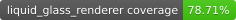
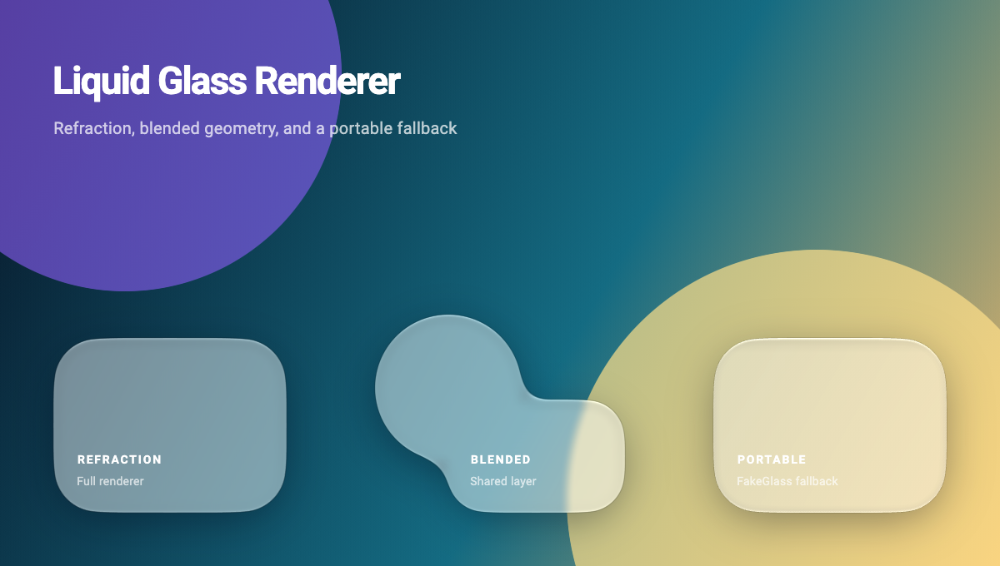

# Liquid Glass Renderer

<!-- [](./test/) -->
[](https://pub.dev/packages/liquid_glass_renderer)
[](./test/)
[![lints by lintervention][lintervention_badge]][lintervention_link]


> ## ⚠️ **EXPERIMENTAL - USE WITH CAUTION**
>
> **This package is still experimental and should be evaluated on every target device.** The full renderer uses Impeller, Flutter GPU, backdrop filtering, and a fragment shader. Unsupported renderers fall back to `FakeGlass`, which preserves blur, tint, lighting, contours, and shadows but omits refraction.
> 
> **Before deploying to production:**
> - **Take a look at the [Limitations](#limitations) and [Performance](#-a-word-on-performance) sections** before even thinking about using this package in production.
> - **Use Impeller and Flutter GPU for full liquid-glass refraction.** Skia receives the portable `FakeGlass` fallback.
> - **Test thoroughly on your target devices**, especially lower-end and mid-range devices
> - **Monitor performance metrics** (memory usage, frame rates, power consumption, jank)
> - **Use `FakeGlass` strategically**: Swap out `LiquidGlass` widgets with `FakeGlass` when they're not highly visible, off-screen, or have low visual impact
>
> **We need your feedback!** Please test on your devices and report performance characteristics, issues, and suggestions.


A Flutter package for creating a stunning "liquid glass" or "frosted glass" effect. This package allows you to transform your widgets into beautiful, customizable glass-like surfaces that can blend and interact with each other.




The image above is generated by `test/src/docs_snapshot_test.dart`. A
successful test run copies the latest Snaptest PNG into `doc/generated`, so the
published example stays tied to executable renderer code.

## Features

-   🫧 **Implement Glass Effects**: Easily wrap any widget to give it a glass effect.
-   🔀 **Blending Layers**: Create layers where multiple glass shapes can blend together like liquid.
-   🎨 **Highly Customizable**: Adjust thickness, color tint, lighting, and more.
-   🔍 **Background Effects**: Apply background blur and refraction.
-   ✨ **Interactive Glow**: Add touch-responsive glow effects to glass surfaces.
-   🔲 **Shadows**: Add performant `BoxShadow`s to glass shapes using optimized canvas primitives.
-   🎭 **Fake Glass**: Lightweight glass appearance without expensive shaders for better performance.
-   🤸 **Stretch Effects**: Apply organic squash and stretch animations to glass widgets.

## Installation

**In order to start using Flutter Liquid Glass you must have the [Flutter SDK][flutter_install_link] installed on your machine.**

Install via `flutter pub add`:

```sh
flutter pub add liquid_glass_renderer
```

And import it in your Dart code:

```dart
import 'package:liquid_glass_renderer/liquid_glass_renderer.dart';
```

## How To Use

The liquid glass effect is achieved by taking the pixels of the content *behind* the glass widget and distorting them. For the effect to be visible, you **must** place your glass widget on top of other content. The easiest way to do this is with a `Stack`.

Make sure to read the [Performance](#-a-word-on-performance) section for tips on getting the best performance out of the package.

```dart
Stack(
  children: [
    // 1. Your background content goes here
    MyBackgroundContent(),

    // 2. Create a layer for liquid glass effects
    LiquidGlassLayer(
      // 3. Add your LiquidGlass widgets here
      child: LiquidGlass(
        shape: LiquidRoundedSuperellipse(borderRadius: 30),
        child: const SizedBox.square(dimension: 100),
      ),
    ),
  ],
)
```

### What's in the box?

This package provides several widgets to create the glass effect:

| Widget                    | Use Case                                                                                   |
| ------------------------- | ------------------------------------------------------------------------------------------ |
| `LiquidGlassLayer`        | Container for all liquid glass effects. Required parent for `LiquidGlass` widgets.         |
| `LiquidGlass`             | Creates a single glass shape. Must be inside a `LiquidGlassLayer`.                         |
| `LiquidGlass.auto`        | Automatically uses a parent `LiquidGlassLayer` if available, or creates its own.           |
| `LiquidGlassBlendGroup`   | Groups multiple `LiquidGlass.grouped` shapes to blend them together seamlessly.            |
| `FakeGlass`               | Lightweight glass appearance without refraction. Better performance, less visual fidelity. |
| `GlassGlow`               | Add touch-responsive glow effects to glass surfaces.                                       |
| `LiquidStretch`           | Add interactive squash and stretch effects to glass widgets.                               |

### ⚠️ Limitations

As this is a pre-release, there are a few things to keep in mind:

- **Full refraction requires Impeller and Flutter GPU.** When shader filters or Flutter GPU are unavailable, `LiquidGlassLayer` uses `FakeGlass`. The package currently declares Android, iOS, and macOS support; other platforms are not release-tested.
- **Memory spike when animating shapes** There is a [bug in Flutter](https://github.com/flutter/flutter/issues/138627) that prevents us from disposing generated textures immediately, leading to temporary memory spikes when animating glass shapes. Read [A word on Performance](#-a-word-on-performance) for tips on minimizing this.
- **Maximum of 16 shapes** can be blended in a `LiquidGlassBlendGroup`, and performance will degrade significantly with the more shapes you add in the same group.
- **Blur** introduces artifacts when blending shapes. Upvote [this issue](https://github.com/flutter/flutter/issues/170820) to get that fixed.


### 🚨 A word on Performance

The full effect has two distinct costs: an SDF geometry texture that is cached
while shapes are unchanged, and a clipped backdrop/refraction pass over the
visible glass pixels. `FakeGlass` skips geometry encoding and refraction, but
still pays for blur, tint/saturation, lighting, and shadows; it is not a
zero-cost replacement.

#### Memory Usage
Unfortunately, due to a [Flutter bug](https://github.com/flutter/flutter/issues/138627), we cannot dispose of these textures immediately, which may lead to temporary memory spikes when animating glass shapes. Please upvote the issue to help get it fixed!

#### Best Practices
To ensure the best performance when using liquid glass effects, consider the following tips:
- **Use `LiquidGlassLayer` for shapes that share the same settings.** Creating many individual layers is expensive.
- **Keep actual glass coverage compact.** The final shader is clipped to the
  material bounds, not the entire `LiquidGlassLayer` widget. Geometry textures
  cover the union of their shapes, so distant shapes can still enlarge cached
  mattes.
- **Limit the number of blended shapes**: Each additional shape in a `LiquidGlassBlendGroup` increases the computational load. 
Try to keep the number of blended shapes low.
- **Prefer whole-layer transforms over moving shapes inside a layer.** Static
  geometry and ancestor-only translation reuse the cached matte. Moving or
  reshaping a member invalidates its geometry; in a blend group that rebuilds
  the combined matte.
- **Treat independent layers as expensive.** Sixteen shapes sharing one layer
  have measured far cheaper than sixteen independent backdrop-filter layers.
  Share settings in one layer unless overlap or compositing semantics require
  isolation.
- **Backdrop sharing is opt-in.** `useBackdropGroup` or an explicit
  `backdropKey` can share capture work for non-overlapping effects. Do not reuse
  one key for overlapping backdrop filters.
- **Shadows do not expand the refraction pass.** They are painted before the
  clipped glass pass. Their Gaussian support still increases shadow-layer
  bandwidth, so keep very large blur radii intentional.

---

## Examples

### `LiquidGlass`: A Single Glass Shape

To create glass shapes, you must wrap them in a `LiquidGlassLayer`. This layer manages the rendering of all glass effects within it.

```dart
import 'package:flutter/material.dart';
import 'package:liquid_glass_renderer/liquid_glass_renderer.dart';

class MyGlassWidget extends StatelessWidget {
  @override
  Widget build(BuildContext context) {
    return Scaffold(
      backgroundColor: Colors.white,
      body: Stack(
        children: [
          // This is the content that will be behind the glass
          Positioned.fill(
            child: Image.network(
              'https://picsum.photos/seed/glass/800/800',
              fit: BoxFit.cover,
            ),
          ),
          // The LiquidGlassLayer manages glass rendering
          Center(
            child: LiquidGlassLayer(
              settings: const LiquidGlassSettings(
                thickness: 20,
                frost: 10,
                tint: Color(0x33FFFFFF),
              ),
              child: LiquidGlass(
                shape: LiquidRoundedSuperellipse(
                  borderRadius: 50,
                ),
                child: const SizedBox(
                  height: 200,
                  width: 200,
                  child: Center(
                    child: FlutterLogo(size: 100),
                  ),
                ),
              ),
            ),
          ),
        ],
      ),
    );
  }
}
```

If you need a single glass shape with custom settings and don't want to create a separate `LiquidGlassLayer`, you can use `LiquidGlass.withOwnLayer`:

```dart
LiquidGlass.withOwnLayer(
  settings: const LiquidGlassSettings(
    thickness: 15,
    frost: 8,
  ),
  shape: LiquidRoundedSuperellipse(borderRadius: 30),
  child: const SizedBox.square(dimension: 100),
)
```

If you don't know whether a `LiquidGlassLayer` exists as an ancestor, use `LiquidGlass.auto`. It will render on a parent layer if one is found, or create its own layer otherwise:

```dart
LiquidGlass.auto(
  settings: const LiquidGlassSettings(
    thickness: 15,
    frost: 8,
  ),
  shape: LiquidRoundedSuperellipse(borderRadius: 30),
  child: const SizedBox.square(dimension: 100),
)
```

The `settings` and `fake` parameters are only used as a fallback when no parent layer is present. When a parent layer exists, its settings take precedence.

**Note:** Make sure you have read the [Performance](#-a-word-on-performance) section for tips on getting the best performance out of the package.

#### Supported Shapes

The LiquidGlass widget supports the following shapes:

-   `LiquidRoundedSuperellipse` (recommended) - A smooth, rounded squircle shape
-   `LiquidOval` - A perfect ellipse/circle
-   `LiquidRoundedRectangle` - A rounded rectangle

All shapes take a simple `double` for `borderRadius` instead of `BorderRasdius` or `Radius`, since they don't support non-uniform radii.


### `LiquidGlassBlendGroup`: Blending Multiple Shapes

To blend multiple glass shapes together seamlessly, wrap them in a `LiquidGlassBlendGroup` inside a `LiquidGlassLayer`. Use `LiquidGlass.grouped()` for shapes that should blend together.

```dart
LiquidGlassLayer(
  settings: const LiquidGlassSettings(
    thickness: 20,
    frost: 10,
  ),
  child: LiquidGlassBlendGroup(
    blend: 20.0, // Controls how much shapes blend together
    child: Column(
      mainAxisAlignment: MainAxisAlignment.center,
      children: [
        LiquidGlass.grouped(
          shape: LiquidRoundedSuperellipse(
            borderRadius: 40,
          ),
          child: const SizedBox.square(dimension: 100),
        ),
        const SizedBox(height: 50),
        LiquidGlass.grouped(
          shape: LiquidRoundedSuperellipse(
            borderRadius: 40,
          ),
          child: const SizedBox.square(dimension: 100),
        ),
      ],
    ),
  ),
)
```

You can have multiple `LiquidGlass` widgets in a `LiquidGlassLayer` without blending by using the default `LiquidGlass()` constructor (not `.grouped()`).

## Customization

### `LiquidGlassSettings`

You can customize the appearance of the glass by providing `LiquidGlassSettings` to a `LiquidGlassLayer`, `LiquidGlass.withOwnLayer()`, or `LiquidGlass.auto()`. All glass widgets within that layer will share these settings.

For the closest validated match to the light iOS 27 toolbar material, start
with the size-specific preset and tune it for your control:

```dart
const LiquidGlassSettings.ios27ToolbarLight()
```

The preset is deliberately not the universal default. Apple's material varies
with control size and appearance; this fit targets a toolbar-sized capsule in
light appearance.

```dart
LiquidGlassLayer(
  settings: const LiquidGlassSettings.ios27ToolbarLight(),
  child: LiquidGlassBlendGroup(
    blend: 40, // blend is now on LiquidGlassBlendGroup, not settings
    child: // ... your LiquidGlass.grouped widgets
  ),
)
```

Here's a breakdown of the key settings:

-   `tint`: Unified material tint; alpha controls transmission.
-   `thickness`: Optical profile depth in logical pixels.
-   `edgeRefraction`: Peak edge displacement in pixels.
-   `refractionSpread`: Extends the SDF optical profile into the face without magnifying the backdrop.
-   `backdropScale`: Scales the deep-face backdrop while fading to identity at the refractive contour (`< 1` reveals more content; `> 1` magnifies).
-   `frost`: Background softening strength (0 = no blur).
-   `chromaticAberration`: Wavelength separation at the refracted edge.
-   `highlight`: Paired directional edge-light strength.
-   `contourStrength`, `contourWidth`: SDF-derived dark dielectric outline.
-   `transmissionGamma`, `vibrancy`, `saturation`: Display transfer and color response.

**Note:** The `blend` parameter has been moved from `LiquidGlassSettings` to the `LiquidGlassBlendGroup` constructor, as it specifically controls shape blending behavior.

Increasing saturation when using colored glass helps achieve an Apple-like aesthetic.

Keep `backdropScale` close to `1` for subtle material treatments. Values above
`1` enlarge pixels from the already-captured backdrop and therefore lose
detail. For a loupe or other strong magnification, paint the higher-resolution
view first with Flutter's `RawMagnifier`, then apply ordinary liquid glass so
its edge refraction and lighting remain crisp.

### Adding Blur

You can apply a background blur using the `frost` property in `LiquidGlassSettings`. This is independent of the glass refraction effect.

```dart
LiquidGlassLayer(
  settings: const LiquidGlassSettings(
    frost: 10.0,
    thickness: 20,
  ),
  child: // ... your glass widgets
)
```


### Child Placement

The `child` of a `LiquidGlass` widget can be rendered either "inside" the glass or on top of it using the `glassContainsChild` property.

-   `glassContainsChild: false` (default): The child is rendered normally on top of the glass effect.
-   `glassContainsChild: true`: The child is part of the glass, affected by color tint and refraction.

### Shadows

You can add shadows to any `LiquidGlass` widget using the `shadows` parameter. Shadows are rendered using optimized canvas primitives (e.g. `drawRRect`, `drawOval`) matched to the glass shape, rather than rasterizing an arbitrary `Path` with a blur `MaskFilter`, so they remain performant.

For best results, use `BlurStyle.outer` and avoid offsets. This keeps the shadow evenly distributed around the glass edge, which looks most natural with glass effects. A combination of a tight, subtle shadow and a softer, wider one works well:

```dart
LiquidGlass(
  shape: LiquidRoundedSuperellipse(borderRadius: 30),
  shadows: const [
    // Tight, subtle edge shadow
    BoxShadow(
      blurStyle: BlurStyle.outer,
      color: Color.from(alpha: 0.05, red: 0, green: 0, blue: 0),
      blurRadius: 2,
    ),
    // Softer, wider ambient shadow
    BoxShadow(
      blurStyle: BlurStyle.outer,
      color: Color.from(alpha: 0.1, red: 0, green: 0, blue: 0),
      blurRadius: 30,
    ),
  ],
  child: const SizedBox.square(dimension: 150),
)
```

Shadows work with all `LiquidGlass` constructors (`.grouped()`, `.withOwnLayer()`, `.auto()`), as well as `FakeGlass`.

### `FakeGlass`: Lightweight Glass Alternative

For scenarios where performance is critical or you need a glass-like appearance without the computational cost of refraction, use `FakeGlass`. It provides a similar visual effect using backdrop filters instead of shaders.

```dart
FakeGlass(
  shape: LiquidRoundedSuperellipse(
    borderRadius: 20,
  ),
  settings: const LiquidGlassSettings(
    frost: 10,
    tint: Color(0x33FFFFFF),
  ),
  child: const SizedBox(
    height: 100,
    width: 100,
    child: Center(child: Text('Fast Glass')),
  ),
)
```

Alternatively, you can enable fake glass for an entire layer:

```dart
LiquidGlassLayer(
  fake: true,
  settings: const LiquidGlassSettings(
    frost: 10,
    tint: Color(0x33FFFFFF),
  ),
  child: // ... your glass widgets will automatically use FakeGlass
)
```

**Note:** `FakeGlass` does not perform refraction; `edgeRefraction`,
`refractionSpread`, and `backdropScale` are ignored on that fallback path.

### `GlassGlow`: Interactive Touch Effects

Add responsive glow effects that follow user touches. Wrap your content with `GlassGlow` inside your glass widget. The `GlassGlowLayer` is automatically included by `LiquidGlass`.

```dart
LiquidGlassLayer(
  child: LiquidGlass(
    shape: LiquidRoundedSuperellipse(
      borderRadius: 20,
    ),
    child: GlassGlow(
      glowColor: Colors.white24,
      glowRadius: 1.0,
      child: const SizedBox(
        height: 100,
        width: 100,
        child: Center(child: Text('Touch Me')),
      ),
    ),
  ),
)
```

The glow effect automatically appears at touch locations and fades out smoothly when interaction ends.

### `LiquidStretch`: Organic Squash and Stretch

Add interactive squash and stretch effects that respond to user gestures, creating an organic, jelly-like feel:

```dart
LiquidStretch(
  stretch: 0.5,
  interactionScale: 1.05,
  child: LiquidGlass(
    shape: LiquidRoundedSuperellipse(
      borderRadius: 20,
    ),
    child: const SizedBox(
      height: 100,
      width: 100,
      child: Center(child: Text('Stretchy')),
    ),
  ),
)
```

The widget listens to drag gestures and applies smooth squash and stretch transformations without interfering with other gestures.


---

---

For more details, check out the API documentation in the source code.

---

[mason_link]: https://github.com/felangel/mason
[mason_badge]: https://img.shields.io/endpoint?url=https%3A%2F%2Ftinyurl.com%2Fmason-badge
[lintervention_link]: https://github.com/whynotmake-it/lintervention
[lintervention_badge]: https://img.shields.io/badge/lints_by-lintervention-3A5A40

[flutter_install_link]: https://docs.flutter.dev/get-started/install
