# Liquid Glass Renderer

[](https://pub.dev/packages/liquid_glass_renderer)
[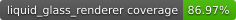](./test/)
[![lints by lintervention][lintervention_badge]][lintervention_link]

iOS 27-style Liquid Glass for Flutter: refraction through a rounded bevel,
frost, tint, a directional glint, a dark border, and shapes that melt into each
other. It is fitted against captures of Apple's own glass, and it ships presets
for the regular, toolbar and clear materials, including the Settings Liquid
Glass slider.

It reproduces the look with Flutter's own rendering; it does not use Apple's
private material APIs.

| Light | Dark |
| --- | --- |
| 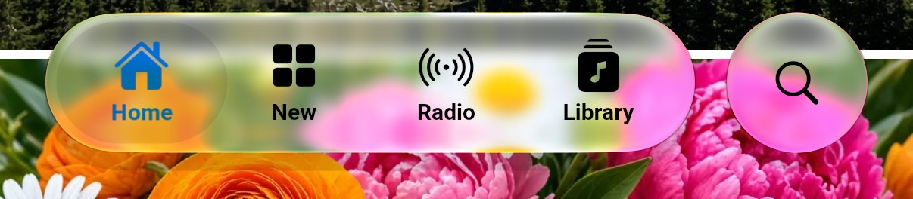 | 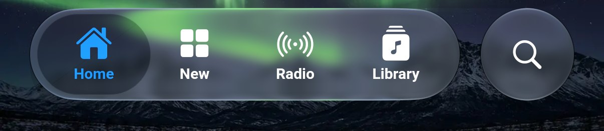 |
| 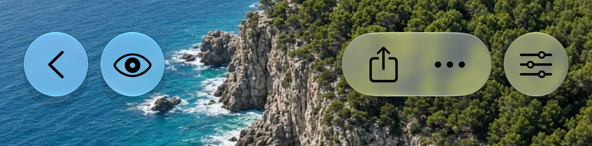 | 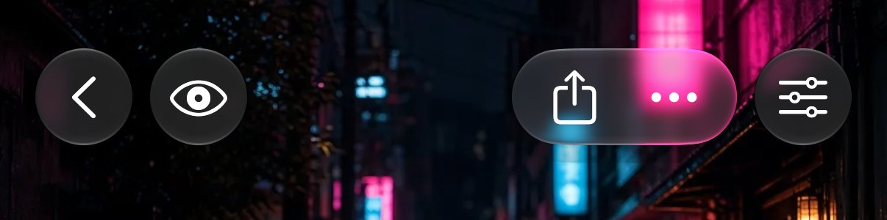 |

> **1.0 prerelease: the renderer was rewritten.**
>
> `1.0.0-dev` replaces the whole API of `0.2.x`. There are no deprecations;
> see the [changelog](CHANGELOG.md) for what moved where. Full glass needs
> Impeller and the Flutter GPU API, which is still in preview. APIs and
> rendering may change before 1.0. Profile your real screens on physical
> devices before shipping.

## Contents

- [Requirements](#requirements)
- [Quick start](#quick-start)
- [The widgets](#the-widgets)
- [Blending shapes](#blending-shapes)
- [iOS 27 presets and the Liquid Glass slider](#ios-27-presets-and-the-liquid-glass-slider)
- [Tint and color](#tint-and-color)
- [Refraction](#refraction)
- [Glint](#glint)
- [Visibility](#visibility)
- [FakeGlass](#fakeglass)
- [Glass on glass and `LiquidGlassCapture`](#glass-on-glass-and-liquidglasscapture)
- [Performance](#performance)
- [Example playground](#example-playground)

## Requirements

- Flutter 3.47 or newer.
- Impeller and Flutter GPU for full glass. Pass `--enable-flutter-gpu` to
  `flutter run`, or turn it on in the app: `FLTEnableFlutterGPU` in
  `Info.plist` (iOS, macOS) and the
  `io.flutter.embedding.android.EnableFlutterGPU` meta-data in
  `AndroidManifest.xml`. The example app shows both.
- iOS, Android and macOS are the platforms the renderer is tested on. Web
  builds compile and render [FakeGlass](#fakeglass).

Wherever full glass is unavailable, layers switch to `FakeGlass`
automatically.

```sh
flutter pub add liquid_glass_renderer
```

## Quick start

Glass samples the pixels behind it, so put your content and the glass in a
`Stack`:

```dart
import 'package:flutter/widgets.dart';
import 'package:liquid_glass_renderer/liquid_glass_renderer.dart';

class GlassPill extends StatelessWidget {
  const GlassPill({super.key});

  @override
  Widget build(BuildContext context) {
    final brightness = MediaQuery.platformBrightnessOf(context);
    return Stack(
      children: [
        const Positioned.fill(child: MyContent()),
        Center(
          child: LiquidGlassLayer(
            settings: LiquidGlassSettings.ios27Toolbar(brightness: brightness),
            child: const LiquidGlass(
              shape: LiquidRoundedSuperellipse(borderRadius: 28),
              child: SizedBox(width: 220, height: 56),
            ),
          ),
        ),
      ],
    );
  }
}
```

Shaders and the GPU pipeline load on first use, so the first glass on screen
paints `FakeGlass` for a frame or two. Warm them up before `runApp`:

```dart
Future<void> main() async {
  WidgetsFlutterBinding.ensureInitialized();
  await LiquidGlass.precache();
  runApp(const MyApp());
}
```

On Android the GPU part finishes after the first frame.

## The widgets

| Widget | What it does |
| --- | --- |
| `LiquidGlassLayer` | Samples the backdrop once and renders every glass shape below it. Owns the shared `LiquidGlassSettings`. |
| `LiquidGlass` | One glass shape. Its child paints on top of the glass, clipped to the shape. |
| `LiquidGlassBlendGroup` | Melts the `LiquidGlass.grouped` shapes inside it into one surface. |
| `LiquidGlassCapture` | Captures the backdrop once for glass that sits on other glass. |
| `LiquidGlassVisibility` | Fades the glass in a subtree in and out. |
| `FakeGlass` | The fallback without refraction, used automatically where full glass is unavailable. |
| `LiquidGlassSettings` | Refraction, frost, glint, border and inner shadow, shared by a layer. |
| `LiquidGlassAppearance` | Tint, color model and visibility, per shape or as a layer default. |

`LiquidGlass` has four constructors:

| Constructor | Use it when |
| --- | --- |
| `LiquidGlass(...)` | A `LiquidGlassLayer` is above it. |
| `LiquidGlass.grouped(...)` | It sits in a `LiquidGlassBlendGroup` and should blend with its neighbors. |
| `LiquidGlass.auto(...)` | Reusable code that may or may not have a layer above it. It uses a parent layer when there is one and creates its own otherwise. |
| `LiquidGlass.withOwnLayer(...)` | It needs its own backdrop sample or its own settings, for example glass on glass. |

Put sibling shapes in one layer. Every independent layer samples the backdrop
again, and that sample is the expensive part (see
[Performance](#performance)).

Shapes are `LiquidRoundedSuperellipse` (squircles and capsules), `LiquidOval`
and `LiquidRoundedRectangle`, each with one corner radius. Exterior shadows go
on the shape, and the renderer cuts them out behind the translucent glass:

```dart
LiquidGlass(
  shape: const LiquidRoundedSuperellipse(borderRadius: 28),
  shadows: const [
    BoxShadow(color: Color(0x24000000), offset: Offset(0, 6), blurRadius: 20),
  ],
  child: const SizedBox(width: 220, height: 56),
)
```

`GlassGlow` adds a touch glow inside the glass, and `LiquidStretch` gives it
the squash and stretch of iOS controls while it is dragged.

## Blending shapes

| Light | Dark |
| --- | --- |
| 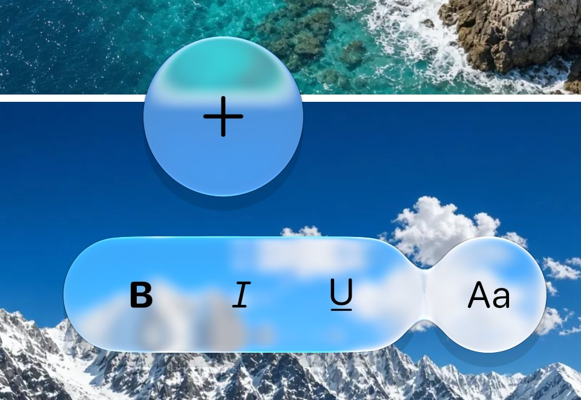 | 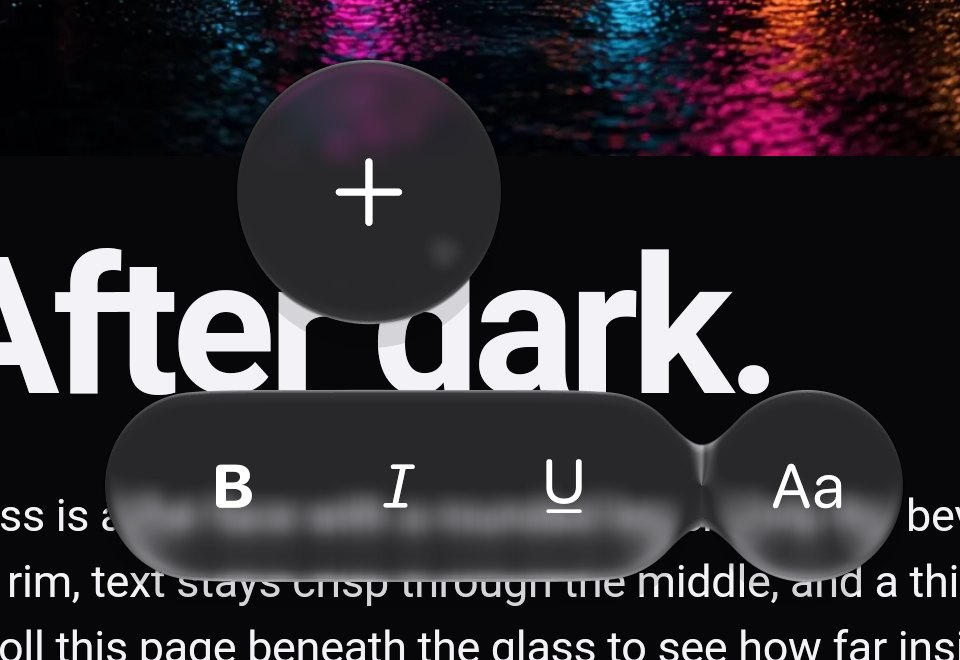 |

Shapes in a `LiquidGlassBlendGroup` join like drops of water once they come
within `blend` logical pixels of each other (default `20`). Straight edges that
touch stay straight; only the gap between them rounds, as in iOS 27's
`GlassEffectContainer`.

```dart
LiquidGlassLayer(
  child: LiquidGlassBlendGroup(
    blend: 24,
    child: Row(
      children: const [
        LiquidGlass.grouped(
          shape: LiquidOval(),
          child: SizedBox.square(dimension: 56),
        ),
        SizedBox(width: 8),
        LiquidGlass.grouped(
          shape: LiquidRoundedSuperellipse(borderRadius: 28),
          child: SizedBox(width: 180, height: 56),
        ),
      ],
    ),
  ),
)
```

A layer renders at most 16 shapes. Plain `LiquidGlass` shapes in the same layer
don't blend.

## iOS 27 presets and the Liquid Glass slider

Glass is configured in two parts. `LiquidGlassSettings` on the layer holds the
optics and lighting. `LiquidGlassAppearance` holds the color, either as the
layer's `defaultAppearance` or per shape.

| Material | Settings | Appearance |
| --- | --- | --- |
| Regular (`.regular`, `.glass` buttons) | `LiquidGlassSettings(frost: LiquidGlassSettings.ios27RegularFrost(t), tintAmount: t)` | `ios27Regular(brightness:)` |
| Toolbar | `ios27Toolbar(brightness:)` | `ios27Toolbar(brightness:)` |
| Clear (`.clear`) | `ios27Clear()` | `ios27Clear()` |

Light and dark variants exist as separate constructors too
(`ios27ToolbarLight`, `ios27ToolbarDark`, ...). A layer without a
`defaultAppearance` uses the toolbar appearance for the platform brightness.

```dart
final brightness = MediaQuery.platformBrightnessOf(context);

LiquidGlassLayer(
  settings: LiquidGlassSettings.ios27Toolbar(brightness: brightness),
  defaultAppearance: LiquidGlassAppearance.ios27Regular(brightness: brightness),
  child: const MyToolbar(),
)
```

`t` is the slider position described below. The presets are fitted to
Apple's glass at toolbar and button size. They are a
starting point: Apple also varies its glass with the control's role, size and
accessibility settings.

### `tintAmount`: the Liquid Glass slider

iOS 27 has a Liquid Glass slider in Settings, from Clear (`0`) to Tinted
(`1`). Pass its position as `tintAmount`. The renderer does not read the
system setting; your app decides.

```dart
LiquidGlassSettings.ios27Toolbar(brightness: brightness, tintAmount: 0.5)
```

The slider changes three things, each along a curve fitted to Apple's glass:

- **Wash.** The iOS 27 color model makes its neutral wash more opaque, and
  dark glass denser.
- **Border.** The dark border gets stronger.
- **Blur.** The presets derive `frost` from the slider.
  `LiquidGlassSettings.ios27RegularFrost(tintAmount)` gives 2, 6.1 and
  16.6 pt at 0, 0.5 and 1; `ios27ClearFrost(tintAmount)` gives 0.35, 1.28 and
  16.4 pt, growing at one rate up to the middle tick and at twice that rate
  beyond it. Pass `frost` to override.

The glint doesn't change. The direct color model ignores `tintAmount`, and
`tintAmount` never changes an explicit `frost`.

## Tint and color

| Light | Dark |
| --- | --- |
| 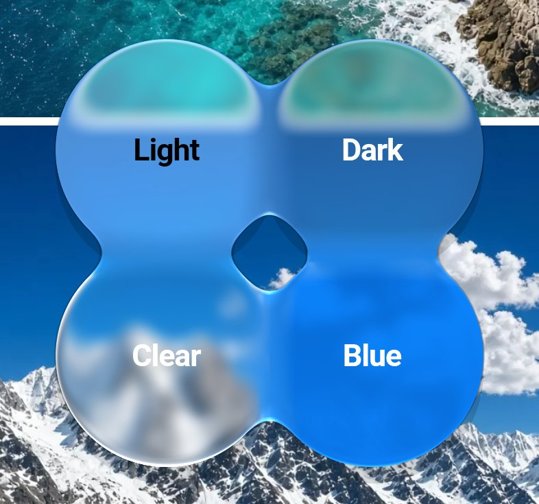 | 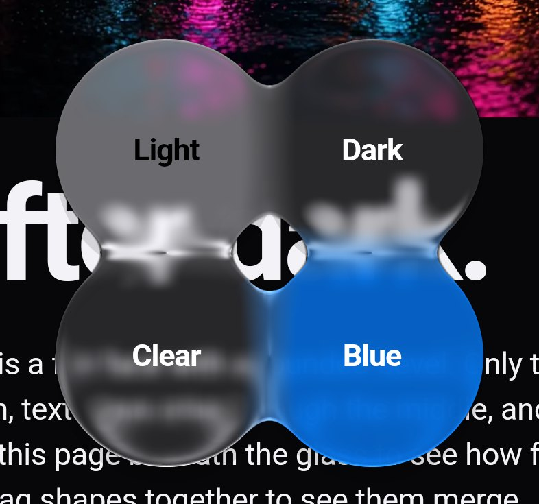 |

Tint a single shape through its appearance. Neighbors in a blend group
cross-fade their colors where they meet, from the same backdrop sample:

```dart
LiquidGlass.grouped(
  appearance: const LiquidGlassAppearance.ios27ToolbarLight(
    tint: Color(0xFF0A84FF),
  ),
  shape: const LiquidOval(),
  child: const SizedBox.square(dimension: 72),
)
```

The iOS 27 presets use `LiquidGlassColorModel.ios27`. It turns one tint color
and its opacity into tones that depend on the brightness of the backdrop,
like Apple's single-tint API. Dark regular glass also gets denser with size:
up to 75 pt on the short side it transmits like light glass, and from 105 pt
it settles at Apple's denser dark material. The smallest shape in a layer
decides. Clear glass (`LiquidGlassColorModel.ios27Clear`) is the same in light
and dark.

For full control, use the direct model and tune each transfer yourself:

```dart
const LiquidGlassAppearance(
  colorModel: LiquidGlassColorModel.direct(),
  tint: Color(0x663B82F6),
  saturation: 1.4,
  transmissionGamma: 0.9,
  vibrancy: 0.15,
)
```

A layer where every shape has the same appearance keeps a smaller shader path.

## Refraction

Glass is modeled as a flat face with a rounded bevel along its edge. Only the
bevel refracts; the face shows the backdrop undisplaced.

- `refractionHeight`: the bevel width in logical pixels (iOS 27: `20`).
- `refractionAmount`: how far inside the silhouette the outermost pixel samples
  the backdrop (iOS 27: `60`). The displacement falls off across the bevel as
  a quarter circle. Above a ratio of 1 to `refractionHeight`, content near the
  rim is mirrored, as on Apple's glass. `0` turns refraction off.
- `refractionFitsShape` (default `true`): small shapes shrink the lens like
  iOS 27 regular glass. The bevel is at most a quarter of the short side, and
  the rim samples no deeper than the center line. Clear glass sets it to
  `false`.
- `backdropShrink`: shrinks the backdrop seen through the whole face. `0`
  keeps its size and `0.08` shows it at 92%. It never enlarges, so the glass
  never pixelates the backdrop. All glass in a layer shrinks about the center
  of the layer's glass; give a shape its own layer to shrink it about itself.
- `dispersion`: splits the colors in the refracted edge. Red moves by
  `1 + dispersion / 2` and blue by `1 - dispersion / 2` times the edge
  displacement; negative values bend blue more, as real glass does. iOS 27
  regular and clear glass show none, so it defaults to `0`, where the glass
  reads the backdrop once per pixel instead of three times.

The backdrop is always sampled bilinearly, so refracted lines move smoothly
instead of snapping to whole pixels.

### Magnifiers

`backdropShrink` never magnifies, because enlarging a captured backdrop makes
it blurry. The [example playground](#example-playground) shows how to build an
iOS 27 text loupe instead: it re-renders the content under the lens at the
magnified resolution and draws `LiquidGlass.withOwnLayer` on top, so text stays
sharp. The loupe is example code, not part of the package; copy
[`example/lib/loupe/liquid_glass_loupe.dart`](example/lib/loupe/liquid_glass_loupe.dart)
if you need one.

| Light | Dark |
| --- | --- |
| 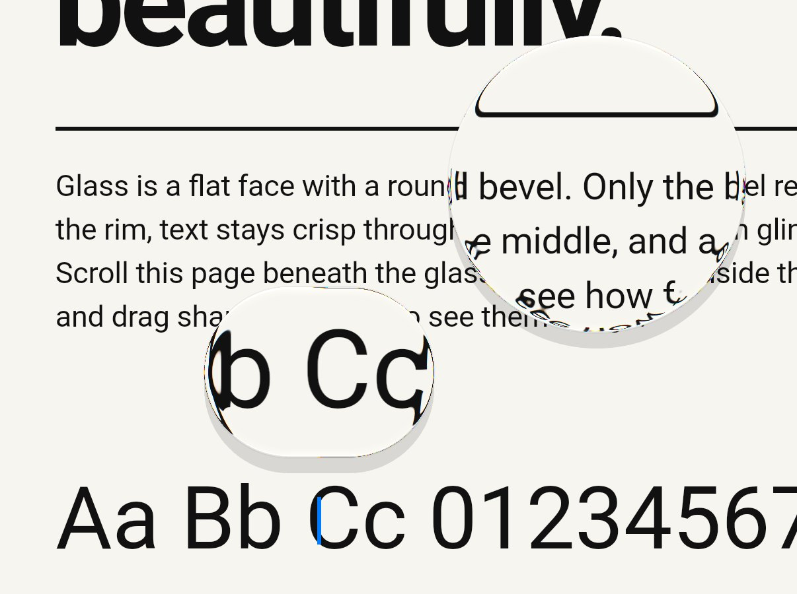 |  |

## Glint

The glint is the thin bright line along the rim, on the two walls facing
along the light. It recolors the glass instead of adding white: glass over color glints in that
color.

`highlight` sets its strength; `1` matches iOS 27 on an iPhone. The line is
1.2 pt wide, equally bright on both walls, and fades around corners as on
iOS 27.

Two more strengths shape the rim: `contourStrength` is the 0.75 pt dark border
just outside the silhouette (`contourDirectionality` concentrates it where the
glint fades), and `bevelShadowStrength` is the faint inner shadow the rim casts
on the face. The defaults and presets set all of them.

### HDR

The glint aims at a color brighter than SDR white. Full glass writes that value
unclamped, so whether it reaches the display depends on the surface Flutter
renders into:

- **iOS**: set `FLTEnableWideGamut` to `true` in `Info.plist`. The surface then
  holds values up to about 1.25, so the brightest part of the glint is
  compressed. Flutter's layer doesn't request extended dynamic range, so the
  values above 1.0 only reach the display once the app sets
  `wantsExtendedDynamicRangeContent` on the Flutter view's `CAMetalLayer`; the
  example app does this in its app delegate.
- **macOS**: with `FLTEnableWideGamut` on capable hardware, the surface keeps
  the full range.
- **Android**: 8-bit surfaces, so the glint is SDR.

`FakeGlass` draws a neutral glint within SDR white.

## Visibility

Visibility is per shape, not a layer setting. Set
`LiquidGlassAppearance.visibility` for one shape, or animate
`LiquidGlassVisibility` around a subtree:

```dart
LiquidGlassVisibility(
  visibility: animation.value,
  child: const Row(
    children: [
      LiquidGlass(shape: LiquidOval(), child: SizedBox.square(dimension: 56)),
      LiquidGlass(shape: LiquidOval(), child: SizedBox.square(dimension: 56)),
    ],
  ),
)
```

As visibility falls, the glass dissolves: refraction goes to zero, lighting and
blur fade, and the shape's child fades with it. Children stay mounted and
interactive. Nested scopes multiply (`0.5` inside `0.4` gives `0.2`). A layer
whose shapes are all invisible stops sampling the backdrop.

Don't fade glass with `Opacity` or `FadeTransition` between the layer and its
shapes; that only fades the children. `Opacity` above a whole
`LiquidGlassLayer` works.

## FakeGlass

| Full glass | `FakeGlass` |
| --- | --- |
|  | 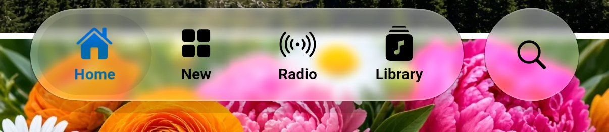 |
|  | 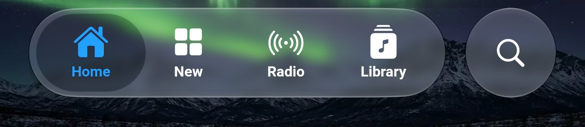 |

Full glass bends the backdrop at the rim; `FakeGlass` keeps everything else.

`FakeGlass` renders glass with a backdrop filter instead of the Flutter GPU
pipeline. Layers use it automatically where full glass is unavailable (Skia,
the web, no Flutter GPU). Set `fake: true` on a layer to use it on purpose, or
to test that path.

It keeps frost, tint, the color model, the glint, the border, the inner
shadow, visibility and exterior shadows. It leaves out refraction,
`backdropShrink`, `dispersion` and vibrancy.

`FakeGlass` is not a cheaper mode: it pays for the same backdrop readback and
blur as full glass (see below).

## Glass on glass and `LiquidGlassCapture`

Apple's guidance is not to stack glass on glass. Sometimes you have to, for
example with an indicator that slides over its tab bar and should refract it.

Every `LiquidGlassLayer` is a `BackdropFilter`, and on Impeller each one copies
the whole render pass behind it, usually the entire screen. Two independent
layers pay that copy twice. You have four options:

| | Backdrop copies | The top glass shows | Trade-off |
| --- | --- | --- | --- |
| Shapes in one `LiquidGlassLayer` | 1 | The content below | Shared settings; the shapes can't refract each other. |
| Layers sharing a `BackdropGroup` (`useBackdropGroup: true`) | 1 | The content below, not the other glass | The indicator doesn't look like it sits on the bar. |
| Independent layers (default) | 1 per layer | The glass below | Cost grows with every layer. |
| Layers inside a `LiquidGlassCapture` | 1 small copy for the capture | The glass below | Content the glass refracts must paint outside the capture. |

`LiquidGlassCapture` copies the backdrop once, only as large as the glass
inside it, and the layers inside read from that small copy. The result looks
the same as independent layers.

```dart
Stack(
  children: [
    content,
    Align(
      alignment: Alignment.bottomCenter,
      child: LiquidGlassCapture(
        child: LiquidGlassLayer(
          // the bar
          child: LiquidGlassLayer(
            // the indicator, refracting the bar
          ),
        ),
      ),
    ),
  ],
)
```

The capture sizes itself to the glass inside plus its blur, refraction and
shadows. Pass `bleed` to size it yourself. A capture the size of the screen
saves nothing.

## Performance

The unit of cost is the backdrop copy, not the glass widget. Measured on a
Pixel 10 (Impeller/Vulkan, 120 Hz, GPU power rail):

| Workload | GPU power |
| --- | --- |
| Backdrop copy alone, per independent `BackdropFilter` | ~115 mW |
| Plain `BackdropFilter` blur, σ7 | ~165 mW |
| `FakeGlass` | ~230 mW |
| Full glass | ~335 mW |
| Two full layers, independent vs. sharing a `BackdropGroup` | 797 vs. 688 mW |
| Glass shadow | ~75 mW per shape |

Best practices:

- **Count backdrop copies per frame.** Put siblings in one layer. Layers over
  the same content can share one copy with `useBackdropGroup: true` or a
  shared `backdropKey`; shared members don't see what paints between them. In
  debug builds the package logs a warning when a frame makes more than one
  independent copy.
- **Keep layers small.** A layer's cost grows with the area its glass covers.
- **Don't animate blend-group geometry every frame.** Moving one shape in a
  group re-renders the whole group's geometry, which can miss 120 Hz. Static
  geometry is cached.
- **Keep shadows few and small.**
- **Mind the blur.** Impeller stops downsampling at σ ≤ 4, which makes small
  blurs cost more than σ7; σ20 costs about three times σ7.
- **For low power, don't sample the backdrop.** `FakeGlass` pays the same copy
  and blur as full glass. When the device or power state calls for it, draw an
  opaque surface instead.
- **Call `LiquidGlass.precache()` before `runApp`.**

The full evidence is in the
[performance audit](example/tool/results/performance-audit.md), and the
[Android GPU power harness](example/tool/README.md#android-pixel-10)
measures your own screens.

## Example playground

```sh
cd packages/liquid_glass_renderer/example
flutter run --enable-impeller --enable-flutter-gpu
```

The playground has an iOS-style tab bar and toolbar, blending and color
scenes, the text loupe, every preset in light and dark, the Liquid Glass
slider, full/fake switching and several backdrops. Settings you tune can be
saved as custom presets.

## Limitations

- Experimental: not yet battle-tested in production apps.
- Full glass needs Impeller and Flutter GPU; the web renders `FakeGlass`.
- At most 16 shapes per layer.
- One corner radius per shape.
- A glass widget's child is painted on top of the glass, never refracted by
  it.

[lintervention_link]: https://github.com/whynotmake-it/lintervention
[lintervention_badge]: https://img.shields.io/badge/lints_by-lintervention-3A5A40
