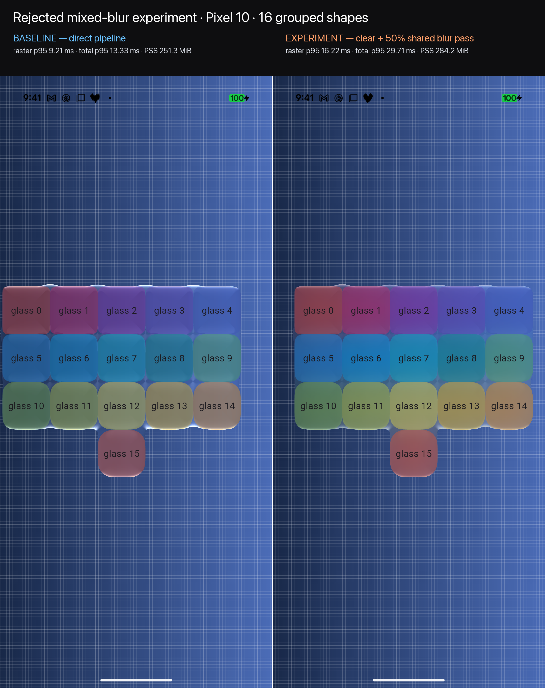

# Performance audit

This is the prioritized backlog for the native benchmark harness. Every change
should be compared against the relevant control scenario on the same runner;
visual output and native `phys_footprint` remain regression gates.

## Current measured state (2026-08-11)

A stabilized three-repetition macOS profile run used profile-mode
Impeller/Metal and native Mach `phys_footprint` sampling. A separate rolling
Metal System Trace validated exact, process-filtered GPU attribution.

- Right-sizing each Flutter GPU uniform host buffer removed about 66 MB from
  the sixteen-independent-layer case and reduced raster p95 from roughly
  12.05 ms to 6.82 ms in matched runs.
- Sixteen independent animated layers still use about 588 MB peak native
  footprint, versus about 365 MB for one static glass. Their latest raster p95
  median is 6.57 ms, with a 19.2% CV and one 8.95 ms outlier, so this workload
  is not yet a reliable production result.
- Sixteen shapes in one layer remain dramatically cheaper (about 386 MB and
  1.59 ms raster p95 in the matched run). Sharing only the backdrop capture
  across sixteen independent layers barely changed memory, attributing the
  remaining growth to per-layer Flutter/Metal filter state.
- A validated static-single Metal trace used an exact 0.897 s target-process
  window: 1,512 GPU intervals, 162.8 ms unioned busy time (18.1%), and 0.64 ms
  interval p95. The enforced parser accepted the trace with no missing-data
  fallback.

These results support prioritizing independent-layer filter/driver state. The
geometry matte is small after host-buffer right-sizing, and shared backdrop
capture does not account for the remaining per-layer footprint.

## 2026-09-01 texture, blur, and compositor audit

The current renderer was re-audited with Flutter 3.47.1 on Impeller/Metal.
Every candidate below used the dedicated profile executable and was removed
unless matched measurements plus the real-glass golden suite justified it.

### Blur findings

- Native sigma-15 blur measured about 2.81 ms/frame for real glass and
  2.51 ms/frame for fake glass. Sigma 40 measured about 2.89 and 2.52 ms/frame
  respectively. The nearly flat high-sigma cost is expected: Impeller already
  downsamples large Gaussian kernels and executes separable vertical and
  horizontal passes. A fixed high sigma therefore does not create a cheaper
  native primitive to fade over a sharp backdrop.
- A one-pass, 13-tap fixed-radius frost prototype reduced the measured real
  frost increment from roughly 1.08 to 0.33 ms/frame. It produced repeated
  source-image ghosts instead of a smooth high-sigma blur and was rejected.
  Increasing tap density without a downsampled source would consume the win.
- Public Flutter does not expose the composited backdrop as a
  `flutter_gpu.Texture`. `ImageFilter.shader` receives one sequential filter
  input, while `ImageFilter.compose` cannot retain a parallel sharp branch.
  Consequently a custom downsample/blur/upscale branch cannot also mix the
  untouched backdrop in one public filter graph. A second backdrop capture or
  engine API would be required, contrary to the package's BackdropFilter-like
  API and likely more expensive than the current native blur.
- `BackdropKey` remains the only public blur-reuse mechanism. It is safe for
  non-overlapping effects and is already exposed explicitly. Automatically
  assigning one global key would make overlapping glass sample the wrong
  backdrop; detecting and coloring overlaps across independently transformed
  layer trees would add substantial lifecycle complexity. No automatic keying
  change is justified.

### Regular/clear backdrop-mixing experiment — rejected

Flutter's public image-filter graph cannot provide one runtime shader with
parallel sharp and blurred versions of the live backdrop. To measure the best
available package-level approximation, the benchmark rendered clear real
glass first, then composited one shared sigma-25 blur-only layer at 50% opacity.
The second layer disabled tint and surface lighting. This is a sequential
approximation—the blur samples the already-rendered clear result—and therefore
an upper-bound prototype rather than a semantic match for Apple's parallel
mix.

The direct control creates one grouped `BackdropFilterLayer`, one geometry
matte, and one coordinate texture. The experiment creates two grouped
`BackdropFilterLayer`s, two geometry mattes, two coordinate textures, and the
native blur intermediate for its upper layer. It therefore adds one backdrop
filter and one complete grouped material pass. Flutter does not expose the
native blur intermediate's allocation size, so the process-footprint deltas
below are the observable allocation evidence.

The prototype exercises clear refraction underneath a regular fixed blur,
the 50% midpoint, refractive edges, and transmitted colored/grid content. It
failed the coarse architectural gate before per-shape mix transport was added.
Differing per-shape mix values, blend-junction interpolation, and mix-driven
visibility were intentionally not implemented after that failure: all would
retain the already-disqualifying extra filter/pass, and retaining scaffolding
only to benchmark rejected semantics would violate the deletion requirement.
Per-shape color and visibility were instead verified independently on the
retained direct pipeline below.

The direct control used one grouped layer with thickness 30 and sigma-15
frost. The experiment stacked a grouped clear layer (thickness 30, zero frost)
under a second grouped sigma-25 blur-only layer at 50% opacity. The macOS run
used Flutter 3.47.1, profile-mode Impeller/Metal, macOS 26.6.2, a 3 s warm-up,
5 s measurement, and three fresh-process repetitions per scenario. Values
below are medians:

| Shapes | Pipeline | Frames | Raster p50 | Raster p95 | Raster p99 | Total p95 | GPU/frame | Peak footprint | Settled footprint |
|---:|---|---:|---:|---:|---:|---:|---:|---:|---:|
| 1 | direct | 611 | 1.45 ms | 1.83 ms | 1.97 ms | 2.60 ms | 2.00 ms | 442.5 MB | 440.8 MB |
| 1 | mixed | 611 | 0.91 ms | 1.93 ms | 2.14 ms | 2.83 ms | 1.84 ms | 630.7 MB | 630.8 MB |
| 4 | direct | 611 | 1.47 ms | 1.88 ms | 2.31 ms | 2.87 ms | 2.33 ms | 436.7 MB | 443.1 MB |
| 4 | mixed | 611 | 1.01 ms | 2.30 ms | 2.48 ms | 3.31 ms | 2.02 ms | 652.9 MB | 657.1 MB |
| 16 | direct | 595 | 1.46 ms | 1.77 ms | 1.92 ms | 3.03 ms | 3.88 ms | 444.4 MB | 451.3 MB |
| 16 | mixed | 598 | 3.51 ms | 4.94 ms | 5.27 ms | 5.58 ms | 4.45 ms | 772.1 MB | 772.3 MB |

At sixteen shapes the approximation increased raster p95 by 179%, total p95
by 84%, GPU time per frame by 15%, and peak native footprint by 327.7 MB. The
one- and four-shape GPU readings moved in the opposite direction while raster
and memory worsened, so those small GPU deltas are treated as command-buffer
timing noise rather than a win. The sixteen-shape mixed memory cooldown also
failed to settle in all three repetitions; that weakens its exact retained
delta but not the consistently 772 MB peak.

A reconstructed Pixel 10 pass used Flutter 3.47.1, profile-mode
Impeller/Vulkan, Android build `CP2A.260805.005`, the same 3 s warm-up and 5 s
measurement, and three fresh `flutter run` processes per scenario. The
reconstruction used the exact documented two-layer configuration above; it
was rebuilt only to complete the missing Android percentile and memory
evidence, then deleted again. PSS is a post-measurement `dumpsys meminfo`
sample collected before terminating each process. Values are medians:

| Shapes | Pipeline | Frames | Raster p50 | Raster p95 | Raster p99 | Total p95 | Settled PSS |
|---:|---|---:|---:|---:|---:|---:|---:|
| 1 | direct | 301 | 5.30 ms | 10.75 ms | 13.33 ms | 14.18 ms | 248.3 MiB |
| 1 | mixed | 302 | 5.91 ms | 14.66 ms | 17.37 ms | 18.59 ms | 266.3 MiB |
| 4 | direct | 301 | 5.03 ms | 10.81 ms | 13.26 ms | 14.65 ms | 247.5 MiB |
| 4 | mixed | 303 | 5.23 ms | 14.16 ms | 16.88 ms | 18.04 ms | 268.7 MiB |
| 16 | direct | 301 | 5.00 ms | 9.21 ms | 12.21 ms | 13.33 ms | 251.3 MiB |
| 16 | mixed | 292 | 14.58 ms | 16.22 ms | 30.45 ms | 29.71 ms | 284.2 MiB |

The mixed path raised median total p95 by 31.1%, 23.1%, and 123.0% at 1, 4,
and 16 shapes respectively. Raster p95 rose by 36.4%, 31.0%, and 76.1%; PSS
rose by 7.2%, 8.5%, and 13.1%. The direction was stable in all repetitions:
direct/mixed raster-p95 ranges were 10.28–10.84/14.63–14.87 ms at one shape,
10.04–11.13/13.88–14.64 ms at four, and 9.15–10.06/16.12–16.33 ms at sixteen.
The corresponding PSS ranges were 244.8–249.0/265.8–283.5 MiB,
247.4–250.9/264.7–273.7 MiB, and 246.1–252.4/277.7–284.2 MiB.

Android command-buffer GPU time and a continuously sampled peak PSS were not
observable through the current Android benchmark channel; they are reported
as unavailable rather than inferred. macOS provides both GPU/frame and peak
native footprint. The Android frame count, full raster percentiles, total p95,
and settled PSS independently reject the experiment.



The experiment fails the performance-neutral gate on both platforms and is
rejected. No clear-versus-blurred per-shape parameter will enter the public
API. The benchmark-only prototype and its scenario switches were deleted after
the measurements and annotated visual evidence were captured.

### Retained per-shape appearance path

A focused three-repetition macOS profile run on 2026-09-02 compared the
retained uniform-appearance fast path with otherwise identical grouped scenes
whose shapes carried different tint, saturation, transmission-gamma, and
vibrancy values. It used Flutter 3.47.1, Impeller/Metal, a 2 s warm-up, a 4 s
measurement, and fresh processes. Values below are medians:

| Shapes and state | Appearance | Raster p95 | Total p95 | In-process GPU/frame | Peak `phys_footprint` |
|---|---|---:|---:|---:|---:|
| 1, static | uniform | 2.15 ms | 2.68 ms | 1.68 ms | 428.5 MB |
| 1, static | colored | 1.99 ms | 2.39 ms | 1.62 ms | 431.8 MB |
| 4, motion | uniform | 1.80 ms | 2.59 ms | 2.18 ms | 435.8 MB |
| 4, motion | colored | 1.85 ms | 2.68 ms | 2.20 ms | 438.5 MB |
| 16, motion | uniform | 1.79 ms | 2.95 ms | 3.94 ms | 444.3 MB |
| 16, motion | colored | 1.79 ms | 2.89 ms | 3.78 ms | 447.7 MB |
| 16, color + visibility motion | colored | 1.80 ms | 2.93 ms | 3.92 ms | 449.5 MB |

The four-shape colored motion path added 0.05 ms raster p95 (2.8%) and
0.02 ms GPU/frame (0.9%). At sixteen shapes, colored and uniform raster p95
were identical; total p95 and GPU/frame were slightly lower in the colored
run, while peak footprint was 3.4 MB (0.8%) higher. Animating visibility on
the colored sixteen-shape scene added 0.01 ms raster p95, 0.04 ms total p95,
0.14 ms GPU/frame, and 1.8 MB peak footprint relative to colored motion. These
small deltas are within launch-to-launch noise and do not demonstrate a
material regression.

The static four- and sixteen-shape raster samples had 46.3% and 45.8%
coefficients of variation because one repetition in each was much faster than
the other two. They are intentionally omitted rather than averaged into a
favorable result. Motion was repeatable: raster CV was 1.0–6.0%, GPU CV was
1.9–3.7% except for the uniform sixteen-shape control at 20.5%, and footprint
CV was at most 2.1%. Native Metal trace capture was disabled for this focused
run, so GPU attribution comes from in-process command-buffer spans and remains
informational.

A fresh Pixel 10 profile pass used Flutter 3.47.1, Impeller/Vulkan, a 3 s
warm-up, and an 8 s measurement. Every repetition reinstalled the APK to force
a new process; PSS is a settled post-measurement `dumpsys meminfo` sample.
Values below are medians of three repetitions:

| Shapes and state | Appearance | Frames | Raster p95 | Raster p99 | Total p95 | Settled PSS |
|---|---|---:|---:|---:|---:|---:|
| 1, static | uniform | 483 | 13.11 ms | 14.55 ms | 15.45 ms | 251.7 MB |
| 1, static | colored | 483 | 6.90 ms | 8.09 ms | 10.68 ms | 255.4 MB |
| 4, static | uniform | 483 | 13.29 ms | 14.22 ms | 15.44 ms | 252.6 MB |
| 4, static | colored | 482 | 13.00 ms | 13.68 ms | 15.21 ms | 252.2 MB |
| 4, motion | uniform | 483 | 9.99 ms | 12.25 ms | 14.35 ms | 244.1 MB |
| 4, motion | colored | 478 | 10.03 ms | 12.95 ms | 14.10 ms | 246.4 MB |
| 4, motion | independent layers | 483 | 8.52 ms | 9.70 ms | 13.88 ms | 281.5 MB |
| 16, static | uniform | 483 | 13.50 ms | 14.12 ms | 15.61 ms | 255.5 MB |
| 16, static | colored | 476 | 7.37 ms | 7.97 ms | 10.81 ms | 255.9 MB |
| 16, motion | uniform | 462 | 23.79 ms | 36.56 ms | 43.33 ms | 243.7 MB |
| 16, motion | colored | 455 | 25.36 ms | 36.94 ms | 45.30 ms | 247.9 MB |
| 16, color + visibility motion | colored | 464 | 24.07 ms | 36.58 ms | 44.14 ms | 249.1 MB |
| 16, motion | independent layers | 291 | 31.14 ms | 34.99 ms | 56.66 ms | 455.7 MB |

At four shapes, per-shape color changed raster p95 by +0.5%, made total p95
1.7% lower, and added 2.2 MB settled PSS. At sixteen shapes it changed raster
p95 by +6.6%, total p95 by +4.5%, and PSS by +4.2 MB. Visibility motion did not add a
measurable timing penalty over the colored scene in this run; its medians were
slightly lower, with 1.2 MB more PSS. These costs preserve most of the grouped
layer advantage documented below.

At four shapes, independent layers had 1.51 ms lower raster p95 than the
colored union, while total p95 differed by only 0.22 ms and independent PSS
was 35.1 MB higher. Grouping is not a universal small-count raster win. At
sixteen shapes, the colored grouped path was 18.6% lower in raster p95, 20.1%
lower in total p95, rendered 56% more frames, and used 207.8 MB less PSS than
independent layers. This is the scale where contributor interpolation must
preserve the grouping benefit, and it does.

Android timings remain bimodal. One of three uniform four- and sixteen-shape
runs and one of three colored sixteen-shape runs entered a slower raster mode.
The one-shape static pair is especially unsuitable for a ratio: uniform runs
spanned 11.77–13.61 ms raster p95, while colored runs split between 6.88 ms and
13.45 ms despite identical 483-frame counts. The table reports medians without
presenting the apparent 47% one-shape reduction as a material-shader win. The
same warning applies to the apparent 45% colored sixteen-static improvement:
the material shader performs extra texture and contributor work, and the
matched macOS runs do not reproduce such a gain. Memory was substantially
steadier than raster timing.

### Texture and compositor findings

- The geometry matte is already a local, device-private RGBA8 texture. All
  four channels are live: two encode the SDF normal, one the signed contour
  distance, and one optical displacement magnitude. Public R8/RG8 formats
  cannot preserve this representation, while R32F has the same four bytes per
  pixel and only 24 reliably packable mantissa bits for normalized data.
- Reducing matte allocation buckets from 64 to adaptive 16/32/64 sizes did not
  lower process memory or GPU time. In the focused run, grouped GPU time rose
  from about 3.21 to 4.33 ms/frame and independent-16 from 5.01 to 5.27;
  independent peak footprint rose from about 775.7 to 798.2 MB. The adaptive
  policy was removed.
- Drawing only the requested region of a retained grow-only texture with a
  tight Flutter-GPU viewport looked promising: `resizeAnimated` improved from
  2.99 to 2.70 ms/frame and `largeResize` from 4.99 to 4.67. It was not a free
  scissor. The viewport changed the effective matte mapping and failed seven
  real-glass goldens by 0.38–2.82%, including affine, DPR, union, shadow, and
  composed-filter coordinates. It was removed without updating goldens.
- Shrinking native filter-bound buckets from 64 to 32 physical pixels reduced
  matched grouped and independent GPU overhead by roughly 9.2% and 7.1%.
  Because the filter uses mirrored blur-edge sampling, the tighter clip changed
  accepted images. It was removed rather than treating a different blur edge
  as a harmless optimization.
- A 3× hysteretic texture downsizing rule was tested with a new
  `largeShrinkSettled` scenario (2048² to 256² before measurement). It lowered
  GPU overhead but worsened raster p95 overhead, exceeded 15% GPU variability,
  and did not demonstrate the expected process-footprint reduction. The
  replacement rule was removed; the scenario remains for future memory audits.
- Direct coordinate uniforms avoided two 2×1 coordinate-texture reads per
  material fragment until ancestor motion, then switched once to the existing
  live texture. The apparent grouped improvement was about 0.05 ms/frame,
  inside run variance, while adding a shader branch and filter rebuild. It was
  removed.

### Retained simplifications

- Real glass no longer pushes an empty `ClipPathLayer` when every child paints
  above the material (the default). Contained children still receive the same
  clip and ordering.
- When a contained child does require that clip, its transformed path is
  cached by geometry identity and transform value. Material-only repaints reuse
  it. Focused tests cover both the default no-layer path and cache invalidation;
  the complete real-glass golden suite remains byte-compatible.
- `realHighBlurOnly`, `fakeHighBlurOnly`, and `largeShrinkSettled` remain in the
  harness as high-signal attribution scenarios. Android-readable compact
  summaries use Flutter logging while the full JSON artifact remains stdout.

### Final retained-state check

A fresh three-repetition macOS profile run of the retained source measured:

| Scenario | Raster p95 median | GPU/frame median | Peak footprint median | CVs (raster / GPU / footprint) |
|---|---:|---:|---:|---:|
| `ancestorTranslatedLayer` | 1.86 ms | 2.07 ms | 562.5 MB | 1.8% / 12.6% / 0.7% |
| `grouped16Motion` | 1.74 ms | 4.06 ms | 409.5 MB | 2.7% / 9.9% / 2.5% |
| `independent16Motion` | 4.30 ms | 5.16 ms | 776.0 MB | 0.2% / 0.4% / 1.7% |

All six focused filter/cache tests, 92 package non-golden tests, 32 example
non-golden tests, the complete 21-case real-glass golden suite, the 10-case
fake-glass suite, and analyzer passed on the retained source. The bottom-bar
golden runner remains unreliable: the combined file can crash, and an isolated
run can log SwiftShader `UNSUPPORTED: VkPrimitiveTopology 11` and omit the
analytic fake surface. The resulting image is not a candidate golden and must
not replace the checked-in device-validated image.

The `baselineMotion` runs showed a 159–163 MB first-sample allocation and
correctly failed the 64 MB step gate. That launch-time process contamination
also made its peak footprint higher than the grouped workload, so the table
does not use baseline memory as an incremental attribution control. The stable
within-scenario grouped/independent results above remain valid; a clean-launch
baseline must be re-established before enforcing a final cross-scenario memory
delta.

The final Android check used a physical Pixel 10 in profile mode with
Impeller/Vulkan and Flutter GPU enabled. Fresh-process results were:

| Scenario | Frames / 8 s | Raster p95 | Total p95 | PSS sample |
|---|---:|---:|---:|---:|
| `baselineMotion` | 483 | 7.46 ms | 14.36 ms | 224.0 MB |
| `grouped16Motion` | 483 | 14.53 ms | 20.78 ms | 278.4 MB |
| `independent16Motion` | 230 | 52.11 ms | 81.96 ms | 541.0 MB |

An independent-16 confirmation with a ten-second warmup still measured
52.95 ms raster p95 and 85.44 ms total p95 (224 frames), proving that result is
not merely shader warmup. Impeller logged concurrent duplicate pipeline
compile requests while the sixteen independent layers initialized, but the
sustained measurement began after those messages. Independent filters remain
the dominant Android cost; one grouped layer is both substantially faster and
about 263 MB lower in PSS in this matched sample.

### Android motion pacing follow-up

On the Pixel 10, sixteen independent layers visibly appear to trail their text
during motion. This is not a delayed geometry-matte rebuild: the whole-layer
transform test proves that the persistent matte is reused, and a frame-by-frame
screen-recording probe tracked the glass edge and label within one pixel for
95% of captured motion. The workload is nevertheless far beyond budget at
roughly 53 ms raster p95 / 85 ms total p95, so the visible symptom is currently
classified as filter/compositor pacing under sustained Vulkan saturation.

An Android-only three-slot ring for the 2×1 coordinate texture was tested in
case the compositor was sampling an in-flight upload. It did not improve the
captured glass/text phase error (mean frame-step disagreement changed from
0.15 px to 0.23 px), was performance-neutral on Pixel, and a global variant
regressed Metal raster/GPU/memory. The experiment was removed. Fixing the
remaining Android pacing issue must start from a dedicated presentation/frame
timeline capture; it must not add per-layer textures or filter snapshots based
only on the visual symptom.

## Implemented in the API audit

- Whole-layer ancestor transforms reuse the local geometry matte. The
  `ancestorTranslatedLayer` scenario distinguishes this fast path from moving
  a shape relative to its layer.
- Fake glass composes blur, saturation, and tint into one backdrop-filter pass
  instead of nesting blur and saturation captures.
- Static benchmark scenarios no longer rebuild under the global animation
  controller.
- `BackdropKey` sharing is explicit, opt-in, supported by both rendering paths,
  and independent from liquid geometry blend groups.
- Geometry mattes grow in 64-physical-pixel buckets and retain their high-water
  allocation, while larger backdrop-filter bounds use non-retaining buckets.
  Native controls showed that replacing a matte during rotation reintroduced a
  167.5 MB step, while exact saveLayer bounds churned every frame. The policy is
  differentiated internally rather than exposed in the consumer API.
- Metal GPU intervals are PID-filtered and clipped to at least 450 ms of exact
  overlap between a timestamped app workload interval and Xcode's retained
  rolling timeline. Allocation/free events are counted only inside that
  interval; peak-live/retained labels are withheld until cross-window resource
  identities and lifetimes can be matched correctly.
- Mach memory/frame metrics and Metal traces run in separate fresh processes;
  combined collection made Instruments add and reclaim roughly 160–180 MB in
  the target, creating false native-memory spikes.
- Frame timing uses real engine vsync in a dedicated profile entry point. Mach
  sampling runs on a native timer, followed by a five-second cooldown whose
  final-window median and slope determine whether memory actually settled.
- Scenarios run three times by default. Enforced results require the requested
  count and reject raster/GPU/footprint coefficients of variation above 15%.
- The final runtime-effect shader uses a fixed half-pixel edge feather because
  Flutter runtime effects do not expose `fwidth`, including under Impeller.
  This removes derivative work but can reduce edge stability under local
  scaling; transformed visual cases remain a regression gate.

## Next measurements

1. **Cull sparse shape layers.** Compare dense and window-spanning layouts at
   1/2/4/8/16 shapes. Add conservative AABB rejection or spatial bins only if
   the comparison isolates shape evaluation as a material part of the frame;
   a spread or density delta by itself is not proof of an SDF bottleneck.
2. **Cache real-path filters and transformed clip paths.** Benchmark a static
   layer repainted by unrelated foreground animation, then cache by settings
   and geometry revision if raster CPU/allocation remains material.
3. **Reuse uniform packing buffers.** A fixed `ByteData`/`Float32List` staging
   buffer can reduce Dart allocation during 16-shape stretch churn.
4. **Evaluate singular-shape specialization last.** A one-shape pipeline removes
   loop and group-marker overhead, but static geometry is already cached and the
   final backdrop/refraction pass may dominate. Measure dynamic oval, rounded
   rectangle, and superellipse cases separately before adding shader variants.

The next looks-first probe is the shared `chromaticAberration` axis:

```bash
cd packages/liquid_glass_renderer/example/tool/apple_match
IOS_27_UDID="$IOS_27_UDID" PYTHONPATH=compare compare/.venv/bin/python material_attribution_scan.py \
  --axis chromaticAberration --repetitions 1 \
  --out out/material-attribution-chromaticAberration
```

It compares the current `.005` default with zero (the one-backdrop-sample
path) and values up to `.1` across toolbar, small, and large capsules. The
upper values are diagnostic: they test whether the relative-displacement
parameterization is merely too weak to see. The scan must pass the existing
two-scene attribution and regression checks before any default or shader policy
change is considered. It is a visual-fit probe, not a substitute for the later
same-runner performance gate.

## Required comparisons

- `baselineMotion` versus `ancestorTranslatedLayer`
- `translatedSingle` versus `scaledRotatedSingle`
- fake 1/4/8/16 shape ladders with blur-only, saturation-only, and combined
  filtering, both grouped and ungrouped
- dense versus sparse 1/2/4/8/16 real shapes at constant total shape area
- small and 1024→2048 resizing under the internal bucketing heuristic

All scenarios, including fake glass, run on Impeller so backend startup and
process baselines remain comparable. Attribute deltas within the same scenario
family; fake glass intentionally bypasses only the Flutter-GPU geometry pass.

## Current redesign audit status (2026-08-25)

Platform smoke gates currently pass with Flutter 3.47.1:

- `flutter build apk --debug` succeeds with Android Impeller and Flutter GPU
  manifest flags enabled.
- `flutter build macos --profile` succeeds with the macOS Impeller and Flutter
  GPU plist flags enabled.
- The focused example widget/YAML/loupe tests and the full non-golden workflow
  pass.

The final performance ratio is intentionally still open. Existing three-run
artifacts are useful historical controls, but they were captured across
different renderer/perf revisions and cannot be presented as a clean
before/after pair for the final state. A final same-runner macOS profile
comparison is required before claiming the ≤5% gate; the Android build is a
platform smoke check, not a substitute for that timing evidence.

The macOS build initially failed because the generated workspace omitted
`Pods/Pods.xcodeproj`; Xcode consequently never produced the
`path_provider_foundation` framework imported by the generated plugin
registrant. Regenerating the workspace with `pod install` restored that project
reference, and a clean Xcode-derived-data Profile build passed. This is a build
integration repair, not a renderer change.

On 2026-08-26, a focused three-repetition `grouped16Motion` trace using only
the GPU and Metal Application instruments produced repeatable app metrics
(raster-p95 CV 1.9%, in-process GPU CV 10.7%, footprint CV 0.8%), but all three
native exports were rejected because most retained windows contained zero GPU
intervals. A one-run Metal-Application-only probe produced no GPU table, so the
GPU instrument cannot simply be removed to solve the problem. These captures
are retained as diagnostic evidence; no native Metal gate is claimed.

The trace harness now uses its existing start-gate handshake: the app waits for
the xctrace readiness notification before emitting its measured windows. The
benchmark app also keeps the expensive scene out of the render loop until that
gate file appears; normal frame/memory runs and production code are unchanged.
After that change, a targeted 8-second grouped capture passed every retained
half-second-window check (58.1% traced GPU utilization, 4.83 ms/frame). Three
repetitions then passed with traced-GPU utilization 55.9/60.7/63.1% (CV 6.1%),
raster-p95 CV 3.2%, in-process GPU/frame CV 7.3%, and footprint-peak CV 1.7%.
The trace result is now sound attribution evidence for this scenario; it is not
a production performance gate or proof that the SDF is the bottleneck.

The focused final-state probe on 2026-08-26 also established a harness detail:
passing xctrace `--window 21s` can produce a one-second trace whose retained
timeline ends before the gated workload starts, so the parser correctly reports
no overlap. Omitting `--window` produced a valid current grouped trace
(35.3% traced GPU utilization, 2.93 ms/frame). The benchmark script therefore
defaults `TRACE_WINDOW_SECONDS` to `0` for opt-in traces. Independent16 still
exceeded the 308-second finalization watchdog in two fresh attempts even with
the complete-trace mode; this is recorded as unresolved Instruments event
density, not as a renderer or SDF regression.

For short high-density probes, `TRACE_WAIT_FOR_READY=false` waits for the
app's post-warmup measurement marker before attaching xctrace. In a
three-repetition independent16 probe, one trace passed (51.4% traced GPU
utilization, 4.31 ms/frame) and two were rejected for event loss; the matching
grouped16 probe had two valid traces and one rejection. These are repeatability
diagnostics, not the final cross-revision performance gate.

The pinned loupe composition scan is now also runnable and truthful: the
`RawMagnifier` owns enlargement, so the 12-candidate grid varies only
`thickness` and `edgeRefraction`; clear-material overrides are recorded rather
than searched. The best fresh pinned score is 13.5557 in
`out/loupe-scorecard-effective/final/scorecard.json`. The harness reproduces
the reference Dynamic Island outside the scored crop and excludes that known
device chrome plus the rounded top-left simulator corner from full-frame
registration; all remaining RGBW control pixels match exactly.

## 2026-08-25 renderer optimization experiments (rejected)

Two focused measurements evaluated candidates; neither is part of the current
renderer and neither is the final gate audit.

- A conservative smooth-union AABB lower bound was evaluated to skip exact
  superellipse evaluation only when `boxLowerBound >= currentDistance + blend`.
  Its first implementation used an unsigned inside-box distance; after fixing
  that correctness issue, there was still no valid end-to-end proof of a win.
  The cull was reverted and its grouped timings are historical only.
- A shared coordinate atlas replaced one 2×1 texture overwrite per animated
  layer with one overwrite per atlas page. The valid three-repetition
  independent16 run produced raster p95 5.20/5.23/5.28 ms (median 5.23 ms,
  CV 0.7%), peak footprints 1036.9/1047.8/1055.5 MB (median 1047.8 MB,
  CV 0.9%), and about 97,269 command-buffer submissions in the one completed
  retry. The pre-atlas focused control was about 111,760 submissions and
  1,061 MB peak. This is a meaningful attribution signal, not a passed ≤5%
  before/after gate. Raster p95 did not improve and the atlas introduced extra
  reader lifecycle/per-frame preparation work, so it was reverted.

The atlas implementation and its focused identity/row test were removed from
the current renderer; no atlas texture, reader registry, or coordinate-row
uniform remains in shipped code.

The focused no-trace audit in `build/benchmark-final-focused-current` measured
median per-run raster means of 1.27 ms (`baselineMotion`), 1.36 ms
(`grouped16Motion`), 3.33 ms (`independent16Motion`), and 1.48 ms
(`layerChurn`); corresponding median raster p95 values were 1.53, 1.91, 5.28,
and 2.08 ms. All four scenario families exceeded the repeatability limit, so
these values are diagnostic only. Independent16 peak footprint remained
approximately 0.93–1.12 GB, and no final ≤5% before/after claim is made.

The transparency harness now enforces the same no-hidden-work discipline for
material fitting: baseline tint RGB is copied exactly, and only `tintAlpha`
and `frost` may vary by slider position. Its structural constraint audit is
recorded alongside the fit scorecards.

## SDF and shader-branch decision (2026-08-26)

Flutter 3.47.1's Impeller `uber_sdf.frag` contains an opt-in rounded-
superellipse SDF path with the same six-step bounded superellipse solve used
by this package. Ordinary Flutter does not always take that path: the canvas
selects UberSDF only when SDFs are enabled and the shape is compatible,
otherwise it uses tessellated rounded-superellipse geometry. The shader also
branches for RSE octant selection and the circular-arc versus superellipse
section. Therefore a branchless rewrite is not an optimization assumption:
per-fragment branches may diverge, while evaluating both sides of a `mix`
can cost more. Keep the branches that select the mathematically required
piecewise SDF.

In the shipped geometry shader, `hasFaceSpread` is a draw-uniform fast path,
but it only avoids the extra `halfMinor` bookkeeping in `sceneSample`; both
paths still evaluate each shape once. The near-zero-chromatic-aberration path
and coverage early returns avoid texture/downstream work and are the more
credible fast paths. The SDF matte is persistent and is rebuilt only when
geometry or settings are dirty, so no SDF bottleneck claim is justified
without a targeted geometry-pass A/B measurement.

The final shader's chromatic path now uses one backdrop read whenever the
maximum encoded displacement multiplied by `abs(chromaticAberration)` is below
0.25 source pixels. This is a coherent uniform branch that removes two texture
reads for the fitted values while preserving the three-sample path for larger
refraction surfaces. The pinned three-scene scan (`out/material-attribution-
chromaticAberration-cutoff/summary.json`) found byte-identical A captures for
0 through `.01`; values above that boundary changed at most a few pixels and
did not improve the score. This is a looks-safe optimization candidate, not a
completed before/after performance gate.

## Shared refraction-spread probe (2026-08-26)

The existing `refractionSpread` axis was tested before adding any new shader
knob. `spread_grid.py` freshly rendered all three recovered geometries on the
pinned iOS 27 simulator for `{0,.0625,.125,.25,.5}`, with two repetitions per
value and a persistent capture session per scene. The toolbar was re-rendered
for every candidate; its settings were not reused as a stale scorecard.

| spread | toolbar combined / score | small combined / score | large combined / score |
|---:|---:|---:|---:|
| 0 | .033417 / 91.7814 | .063668 / 85.2647 | .027357 / 89.4927 |
| .0625 | .033431 / 91.7909 | .063588 / 85.2699 | .027362 / 89.5177 |
| .125 | .033428 / 91.7978 | .063545 / 85.2737 | .027357 / 89.5211 |
| .25 | .033426 / 91.7941 | .063511 / 85.2796 | .027357 / 89.5198 |
| .5 | .033413 / 91.7896 | .063514 / 85.2831 | .027356 / 89.5150 |

The tiny small-capsule improvement at `.25` is only 0.25% and remains 1.90x
the toolbar error (the stated <=1.25x gate); all candidates also miss the
recorded 86.3452 small-capsule pre-change score. This rejects the current
spread axis as the generalization fix. The complete raw rows, repeatability,
and pinned metadata are recorded in
`apple_match/out/spread-grid-current/summary.json`. The final `.5` small
capture is available as [spread-grid candidate](/Users/tim/Developer/flutter_liquid_glass/packages/liquid_glass_renderer/example/tool/apple_match/out/spread-grid-current/small_capsule/live/A.png), with the [Apple reference](/Users/tim/Developer/flutter_liquid_glass/packages/liquid_glass_renderer/example/tool/apple_match/references/ios27-iphone17pro-light/small_capsule/A.png).

## Coupled spread/thickness probe (2026-08-26)

Because spread and thickness enter the shader's reach, slope, and
thickness-derived optical index together, `coupled_spread_scan.py` tested the
existing model jointly: shared spread `{0,.25,.5,.75,1}` and independently
selected thickness `{2,4,6,8,10,12,16}` for each recovered geometry. Every
candidate was freshly rendered once on the pinned simulator and its four probe
captures were retained under `out/coupled-spread-scan/<scene>/candidates/`.
Selection used the existing optics loss (flow plus combined error), never the
cross-scene ratio.

The scan still rejected the model as a generalization fix. The best selected
rows were:

| shared spread | toolbar (thickness / score) | small (thickness / score / combined) | large (thickness / score) |
|---:|---:|---:|---:|
| 0 | 2 / 92.1894 | 2 / 85.6538 / .063231 | 2 / 89.2351 |
| .25 | 2 / 92.2049 | 2 / 85.6319 / .063221 | 2 / 89.2551 |
| .5 | 2 / 92.2069 | 4 / 85.6234 / .063242 | 2 / 89.2459 |
| .75 | 2 / 92.2009 | 4 / 85.6216 / .063287 | 2 / 89.2409 |
| 1 | 2 / 92.1974 | 2 / 85.6428 / .063239 | 2 / 89.2411 |

Small remains about 2.01x the same-spread toolbar error and below the recorded
86.3452 capsule gate at every candidate. No public setting or shader change is
justified by this result. A representative retained image is [coupled candidate](/Users/tim/Developer/flutter_liquid_glass/packages/liquid_glass_renderer/example/tool/apple_match/out/coupled-spread-scan/small_capsule/candidates/spread-1/thickness-2/rep-1/A.png); compare it with the [Apple reference](/Users/tim/Developer/flutter_liquid_glass/packages/liquid_glass_renderer/example/tool/apple_match/references/ios27-iphone17pro-light/small_capsule/A.png). Full numeric rows and selection details are in `out/coupled-spread-scan/summary.json`.

## Shared material attribution probes (2026-08-26)

After the spread/thickness rejection, the existing material vector was tested
one shared scalar at a time on freshly rendered toolbar, small, and large
capsules. Geometry, spread, and every other material field stayed fixed; each
row retained A–D PNGs and diagnostics under its own directory. The probe is
reproducible with:

```bash
IOS_27_UDID="$IOS_27_UDID" compare/.venv/bin/python material_attribution_scan.py \
  --axis frost --out out/material-attribution-frost
```

Frost `{3,4,5,6,7,8,9}` was rejected: small's best score was 86.4094 at 5,
but flow worsened from .036286 to .049595 and combined error worsened from
.063668 to .064354; large only improved at values that regressed toolbar.
Gamma `{.80,.85,.875,.90,.925,.95,1}` was also rejected: small's best
combined error was .063416 at .85 (0.4% better) with no flow improvement, far
below the required attribution threshold. Edge refraction `{0,8,12,18.3,24,32}`
was effectively flat: small's best was .063659/.036182 at 8 versus
.063668/.036286 at the default 18.3, while larger values regressed.
Vibrancy `{0,.075,.15,.225,.30}` reached .063137/.035494 at .30, only a
0.8%/2.2% movement and below the attribution threshold. Tint alpha
`{.48,.505,.53,.555,.58}` reached .063272/.035099 at .555, but reduced the
toolbar/large scores and conflicts with the transparency contract.

These controls therefore remain at their validated defaults; no renderer
change is inferred from sub-threshold movement. Representative pairs are the
[frost candidate](/Users/tim/Developer/flutter_liquid_glass/packages/liquid_glass_renderer/example/tool/apple_match/out/material-attribution-frost/small_capsule/candidates/frost-5/rep-1/A.png), [gamma candidate](/Users/tim/Developer/flutter_liquid_glass/packages/liquid_glass_renderer/example/tool/apple_match/out/material-attribution-gamma/small_capsule/candidates/transmissionGamma-0p85/rep-1/A.png), and [edge candidate](/Users/tim/Developer/flutter_liquid_glass/packages/liquid_glass_renderer/example/tool/apple_match/out/material-attribution-edge/small_capsule/candidates/edgeRefraction-8/rep-1/A.png), each compared against the pinned [Apple small-capsule reference](/Users/tim/Developer/flutter_liquid_glass/packages/liquid_glass_renderer/example/tool/apple_match/references/ios27-iphone17pro-light/small_capsule/A.png). Full rows are in the corresponding `out/material-attribution-*` summaries.
