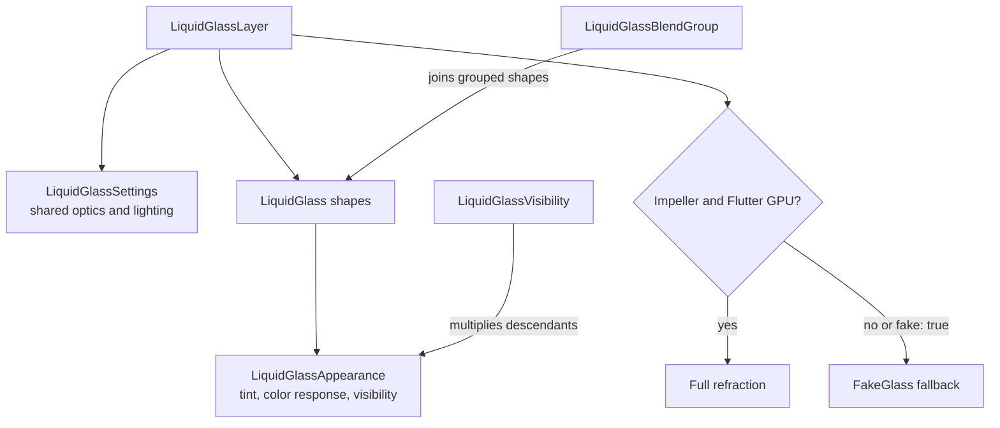

# Review guide

Review the stack from bottom to top. Production fixes and regression tests are
folded into the original renderer and test commits. The new example stays on top.

| Commit | Review focus |
| --- | --- |
| `feat!: rebuild liquid glass renderer for 0.3.0-dev.1` | Public API, real/fake rendering, retained geometry, nested composition, frame-owned coordinates. |
| `build: adopt Flutter 3.47 workspace configuration` | SDK, workspace, and CI. |
| `test: cover final renderer behavior and visual output` | Unit, lifecycle, golden, clipping, and submitted-frame regression tests. |
| `example: add the liquid glass workbench` | Original workbench and loupe behavior. |
| `docs: prepare the 0.3.0-dev.1 prerelease` | Package documentation and release metadata. |
| `perf: add reproducible renderer benchmarks` | Scenarios, parsers, and gates. |
| `harness: add Apple visual fitting pipeline` | Capture, fitting, and provenance tools. |
| `testdata: update audited Apple glass references` | Reference images and audit data. |
| `docs: add renderer review and harness guidance` | Review and harness instructions only. |
| `fix: stabilize nested glass workbench` | New example and its scroll tests; kept on top. |

## API ownership



## Nested scrolling invariants

- Submitted real-glass filters own their coordinate uniforms. A later scroll
  cannot overwrite coordinates used by an older native frame.
- Submitted frames also own immutable geometry and contributor textures.
  Expanding one grouped shape must not overwrite a matte sampled by an older
  frame: its old origin would displace even a stationary sibling. Only changed
  geometry allocates a new bucketed texture; unchanged/translated geometry
  keeps its cached image. There is no extra rendering pass or frame wait.
- The fake-glass tracker is submitted before its effect, exactly once.
- Uniform ancestor motion reuses geometry without repainting the render object.
- Normal children retain ordinary paint ancestry; contained children paint
  beneath their glass surface.
- Nested ungrouped glass gets an ordered material pass, including the implicit
  `Layer -> Glass -> Glass` case. Siblings can still share a pass.
- Common ancestor clips stay in their own coordinate spaces as glass scrolls
  through them. Independent sibling clip batching is not implemented here.

The submitted-scene tests capture the first native frame, avoiding an extra
repaint-boundary traversal that could refresh stale retained state. They also
retain an old native scene across a later scroll and assert unchanged pixels.
Permutation tests compare moved output with an independently laid-out static
destination.

`expanding_blend_frame_test.dart` retains the collapsed bottom-bar scene across
eight resize updates, including growth and shrinkage. It checks the stationary
right button in real/fake modes with uniform/per-shape materials, plus a static
reference golden. Against the old renderer, the real cases changed 1,760 and
3,870 pixels in that stationary region; both fake cases passed. All four pass
with immutable matte generations.

## Verification

From the repository root with Flutter 3.47.1:

```sh
melos analyze
melos test
```

For focused scrolling tests, from `packages/liquid_glass_renderer`:

```sh
flutter test --no-pub --enable-impeller --enable-flutter-gpu \
  test/src/nested_layer_test.dart \
  test/src/nested_scroll_permutations_test.dart \
  test/src/expanding_blend_frame_test.dart \
  test/src/filter_cache_test.dart --concurrency=1
```

The top example adds `example/test/scroll_frame_tracking_test.dart`, covering
Showcase and Playground in real and fake modes. Run real cases with Impeller and
Flutter GPU enabled; run fake cases without the experimental GPU test backend.

For device benchmarks, follow [README.md](README.md). The example also supports
`LIQUID_GLASS_EXAMPLE_PERFORMANCE_PROBE=true`; separate startup from steady scroll
windows and do not infer comparative performance from video alone.

The important performance invariants are:

- Uniform layers do not allocate the per-shape contributor texture.
- Geometry changes allocate immutable textures; they are not a zero-allocation
  path. The renderer releases its image handles when replacing them; queued
  native scenes retain their independent references until no longer needed.
- Per-shape appearance adds no backdrop capture or blur pass.
- A fully invisible layer releases its backdrop filter.
- Real and fake glass preserve the same foreground order.
- The mixed clear/blur experiment is documented but not shipped.

### Immutable-matte performance check

Local macOS profile smoke measurements (Flutter 3.47.1, five-second windows,
not a device release gate): `relativeBlendMotion` raster p95 was 0.776 ms before
and 0.789 ms after; GPU busy was 813/815 ms over the window. Median process
footprint was 435/458 MiB, with peaks of 439/492 MiB. `resizeAnimated` raster
p95 was 0.926 ms before; fixed runs ranged from 0.809 to 1.686 ms, and peak
footprint reached 562 MiB. Fixed runs did not pass the benchmark's memory-slope
stability heuristic. Do not infer zero allocation overhead or production memory
stability from these short runs. Further target-device endurance profiling is
still useful. Reusing a texture that an older scene still samples is not a safe
optimization; a fixed-size texture ring would not establish ownership either.

The intermittent native `flutter_tester`/SwiftShader crash remains unresolved.
The serial focused suite passes, but that is not proof the native crash is
harmless in production.
