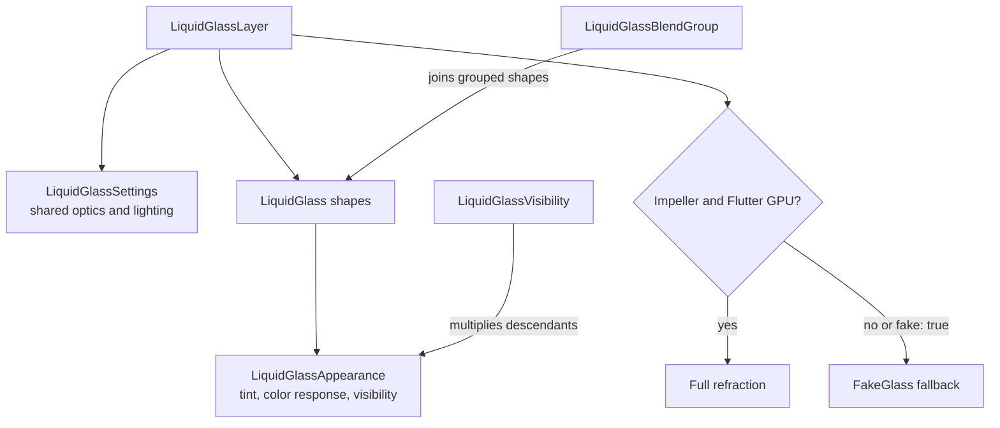

# Review guide

Review the stack from bottom to top. Production fixes and regression tests are
folded into the original renderer and test commits. Later work is stacked on
top as focused commits; the Flutter 3.44 compatibility variant is the tip and
is the only commit that must not be reviewed as part of the 3.47 line.

| Commit | Review focus |
| --- | --- |
| `feat!: rebuild liquid glass renderer for 0.3.0-dev.1` (now shipped as 1.0.0-dev.1) | Public API, real/fake rendering, retained geometry, nested composition, frame-owned coordinates. |
| `build: adopt Flutter 3.47 workspace configuration` | SDK, workspace, and CI. |
| `test: cover final renderer behavior and visual output` | Unit, lifecycle, golden, clipping, and submitted-frame regression tests. |
| `example: add the liquid glass workbench` | Original workbench and loupe behavior. |
| `docs: prepare the 0.3.0-dev.1 prerelease` | Package documentation and release metadata. |
| `perf: add reproducible renderer benchmarks` | Scenarios, parsers, and gates. |
| `harness: add Apple visual fitting pipeline` | Capture, fitting, and provenance tools. |
| `testdata: update audited Apple glass references` | Reference images and audit data. |
| `docs: add renderer review and harness guidance` | Review and harness instructions only. |
| `fix: stabilize nested glass workbench` | New example and its scroll tests. |
| `test: reproduce whole-layer fake glass blur loss during opacity` | Regression test for whole-layer fake frost under an opacity fade. |
| `refactor: remove opacity experiment switches and the example probe` | Hardcodes the shipped defaults of `INDEPENDENT_GLASS_OPACITY`, `NEST_GLASS_CONTENTS`, `WEAK_OPACITY_FILTER`, `HOIST_GLASS_OPACITY`, `PROBE_STABLE_NEAR_OPAQUE_SEED`; deletes dead branches and the probe app. |
| `fix: compile for the web by stubbing the Flutter GPU geometry renderer` | Conditional export; web renders `FakeGlass`. |
| `feat: LiquidGlassSeed bounds backdrop passes to a glass region (experimental)` | Seed render object and seed-relative filter coordinates. |
| `harness: thermal gate, fixed status-bar inset, loupe/pill/seed scenarios` | Benchmark scenes and the Android power harness. |
| `harness: iOS power and Metal trace tooling (xctrace, thermal gate, parser)` | `tool/ios_power/` scripts and their README section. |
| `docs: optimization log, independent renderer review, iPhone results, audit summary` | Measurements, rejected ideas, iPhone 15 results, and the audit update. |
| `feat: LiquidGlassCapture sizes itself and is covered by goldens` | Rename of the seed; `effectBounds` on both layers; pass origin shared with the opacity passes; `LiquidGlass.precache`; per-scene pixel tests and goldens; README "Glass on glass". |
| `chore: prepare the 1.0.0-dev.1 prerelease` | Version, changelog, README. |
| `compat: build against Flutter 3.44 (experimental)` | Tip only. Flutter GPU API and GLES sampling differences; SDK pins. |

## Stack consolidation (2026-09-18)

The 1.0.0-dev.1 stack above is the only line of development. Everything else
that existed in the repository after `main` was audited by content against this
stack and abandoned (152 commits, recoverable from the jj operation log):

| Thread | Commits | Outcome |
| --- | --- | --- |
| Three older copies of the rebuild stack and the Aug 25–28 `perf: reduce independent glass layer overhead` chain | ~100 | Superseded. Their content was squashed into the ten canonical commits; a tree diff against the canonical tip showed nothing unique. |
| `codex/opacity-*` experiment branches (weak filters, single capture, memory plateaus, release measurements, …) | 19 experiments + follow-up fixes | Superseded. Every production fix is folded into the canonical commits; the only unique content was `experiments/opacity-composition/PROGRESS.md` (research notes). Their compile-time A/B switches are removed in `refactor: remove opacity experiment switches`. |
| Duplicate `fix: backport renderer rewrite to Flutter 3.44` commits | 5 | Replaced by the single `compat: build against Flutter 3.44` tip commit, re-derived from the current code (adds the `apple_match` harness SDK pin the originals missed). |
| `test: reproduce whole-layer fake glass blur loss on iOS` (renderer-344) | 1 | Dropped: strict subset of the kept 3.47 test (1×2 vs 3×2 cases). |
| `feat: backport shader-based fake glass` on the 0.2 line | 1 | Dropped: the same consolidated fake glass ships in the rewrite. |
| `codex/web-flutter-3.44` on the 0.2 line | 1 (remote branch kept) | Dropped locally: the 0.2 renderer never used Flutter GPU, so it only needed pubspec metadata. The rewrite needs the stub in `fix: compile for the web`, which supersedes it. The GitHub branch can be deleted. |
| Analytic SDF exterior shadows (`glass_shadow.frag`) | 1 | Dropped after review: in a blend group the analytic smooth union did not match the per-shape silhouettes Flutter draws (fake glass never merges; real glass merges by the group's blend), and `RSuperellipse` cannot be matched exactly by an SDF. Shadows stay on the raster path. |
| Host-regenerated goldens, empty working-copy commits, stale workspaces | 4 + 7 workspaces | Dropped. Goldens are produced by CI on macOS-15 runners; on other Macs six pre-existing goldens differ (`rounded_superellipse_radii`, `liquid_glass_blend_group_stretch_dpr2`, `per_shape_appearance_blending`, `fake_glass_real_comparison`, `liquid_glass_transform_dpr2`, `fake_glass_real_contour_offsets`). |

Known host-only test noise on Apple-silicon Macs with `flutter_tester`
(identical set before and after this stack, so not regressions): 29 opacity
compositing / lifecycle assertions and an intermittent Flutter GPU segmentation
fault. CI is the authority for those suites.

`flutter_tester` also renders only the first subpass that contains a
`BackdropFilter` per process; later ones are black (a 20-line repro with plain
`ClipRect`, identity `ColorFilter` `BackdropFilter` and a blur shows it; Metal
and Vulkan render all of them). The `LiquidGlassCapture` pixel tests therefore
live one scene per file and render the captured scene first;
`example/integration_test/liquid_glass_capture_test.dart` runs every scene,
the fake references under a fade, and dispose/recreate on a real GPU
(`flutter test --enable-impeller -d macos`).

The other device suites install a `SubmittedSceneCapture` binding, which
`flutter test -d macos` rejects because it initializes
`IntegrationTestWidgetsFlutterBinding` before `main`. Run those through
`flutter drive`, which leaves binding setup to the test:

```sh
flutter drive --enable-impeller -d macos \
  --driver=test_driver/backdrop_seed_driver.dart \
  --target=integration_test/independent_opacity_paint_order_test.dart
```

The `outer optical fade` host tests fail under `flutter_tester` on the first
fractional frame after a fully transparent one (the whole frame, including
content outside the glass, rasterizes wrong). They pass on Metal through the
command above.

## API ownership



## Nested scrolling invariants

- Submitted real-glass filters own their coordinate uniforms. A later scroll
  cannot overwrite coordinates used by an older native frame.
- Submitted frames also own immutable geometry and contributor textures.
  Expanding one grouped shape must not overwrite a matte sampled by an older
  frame: its old origin would displace even a stationary sibling. Only changed
  geometry allocates a new bucketed texture; unchanged/translated geometry
  keeps its cached image. There is no extra rendering pass or frame wait.
- The fake-glass tracker is submitted before its effect, exactly once.
- Uniform ancestor motion reuses geometry without repainting the render object.
- Normal children retain ordinary paint ancestry; contained children paint
  beneath their glass surface.
- Nested ungrouped glass gets an ordered material pass, including the implicit
  `Layer -> Glass -> Glass` case. Siblings can still share a pass.
- Common ancestor clips stay in their own coordinate spaces as glass scrolls
  through them. Independent sibling clip batching is not implemented here.

The submitted-scene tests capture the first native frame, avoiding an extra
repaint-boundary traversal that could refresh stale retained state. They also
retain an old native scene across a later scroll and assert unchanged pixels.
Permutation tests compare moved output with an independently laid-out static
destination.

`expanding_blend_frame_test.dart` retains the collapsed bottom-bar scene across
eight resize updates, including growth and shrinkage. It checks the stationary
right button in real/fake modes with uniform/per-shape materials, plus a static
reference golden. Against the old renderer, the real cases changed 1,760 and
3,870 pixels in that stationary region; both fake cases passed. All four pass
with immutable matte generations.

## Verification

From the repository root with Flutter 3.47.1:

```sh
melos analyze
melos test
```

For focused scrolling tests, from `packages/liquid_glass_renderer`:

```sh
flutter test --no-pub --enable-impeller --enable-flutter-gpu \
  test/src/nested_layer_test.dart \
  test/src/nested_scroll_permutations_test.dart \
  test/src/expanding_blend_frame_test.dart \
  test/src/filter_cache_test.dart --concurrency=1
```

The top example adds `example/test/scroll_frame_tracking_test.dart`, covering
Showcase and Playground in real and fake modes. Run real cases with Impeller and
Flutter GPU enabled; run fake cases without the experimental GPU test backend.

For device benchmarks, follow [README.md](README.md). The example also supports
`LIQUID_GLASS_EXAMPLE_PERFORMANCE_PROBE=true`; separate startup from steady scroll
windows and do not infer comparative performance from video alone.

The important performance invariants are:

- Uniform layers do not allocate the per-shape contributor texture.
- Geometry changes allocate immutable textures; they are not a zero-allocation
  path. The renderer releases its image handles when replacing them; queued
  native scenes retain their independent references until no longer needed.
- Per-shape appearance adds no backdrop capture or blur pass.
- A fully invisible layer releases its backdrop filter.
- Real and fake glass preserve the same foreground order.
- The mixed clear/blur experiment is documented but not shipped.

### Immutable-matte performance check

Local macOS profile smoke measurements (Flutter 3.47.1, five-second windows,
not a device release gate): `relativeBlendMotion` raster p95 was 0.776 ms before
and 0.789 ms after; GPU busy was 813/815 ms over the window. Median process
footprint was 435/458 MiB, with peaks of 439/492 MiB. `resizeAnimated` raster
p95 was 0.926 ms before; fixed runs ranged from 0.809 to 1.686 ms, and peak
footprint reached 562 MiB. Fixed runs did not pass the benchmark's memory-slope
stability heuristic. Do not infer zero allocation overhead or production memory
stability from these short runs. Further target-device endurance profiling is
still useful. Reusing a texture that an older scene still samples is not a safe
optimization; a fixed-size texture ring would not establish ownership either.

The intermittent native `flutter_tester`/SwiftShader crash remains unresolved.
The serial focused suite passes, but that is not proof the native crash is
harmless in production.
