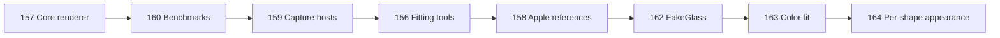
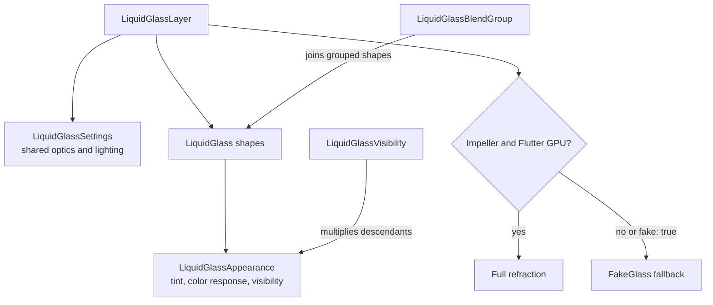

# Review guide

Review the stack from bottom to top. Each PR owns one kind of evidence or one
renderer concern.



| PR | Review focus |
| --- | --- |
| [#157](https://github.com/whynotmake-it/flutter_liquid_glass/pull/157) | Flutter GPU renderer, package API, baseline tests, example, release metadata. |
| [#160](https://github.com/whynotmake-it/flutter_liquid_glass/pull/160) | Device benchmark scenarios, parsers, and CI gates. |
| [#159](https://github.com/whynotmake-it/flutter_liquid_glass/pull/159) | Deterministic Apple and Flutter capture hosts. |
| [#156](https://github.com/whynotmake-it/flutter_liquid_glass/pull/156) | Comparison metrics, fitting, diagnostics, and provenance checks. |
| [#158](https://github.com/whynotmake-it/flutter_liquid_glass/pull/158) | Audited iOS 27 reference images only. |
| [#162](https://github.com/whynotmake-it/flutter_liquid_glass/pull/162) | Portable FakeGlass renderer, ordering, and lifecycle. |
| [#163](https://github.com/whynotmake-it/flutter_liquid_glass/pull/163) | Light/dark transmission fit and real/fake edge alignment. |
| [#164](https://github.com/whynotmake-it/flutter_liquid_glass/pull/164) | Per-shape appearance, visibility, visual proof, and final audit. |

## API ownership



For #164, review these commits in order:

1. Production API and renderer changes.
2. Unit, lifecycle, golden, and constructor-permutation tests.
3. Example controls and per-shape demonstrations.
4. Apple-match visual captures and provenance checks.
5. Device performance evidence and the rejected mixed-blur experiment.
6. README, changelog, and this guide.

## Verification

From the repository root with Flutter 3.47.1:

```sh
melos analyze
melos test
```

For the compact device benchmark, follow
[`PERFORMANCE_AUDIT.md`](PERFORMANCE_AUDIT.md). The important invariants are:

- Uniform layers do not allocate the per-shape contributor texture.
- Per-shape appearance adds no backdrop capture or blur pass.
- A fully invisible layer releases its backdrop filter.
- Real and fake glass preserve the same foreground order.
- The mixed clear/blur experiment is documented but not shipped.
