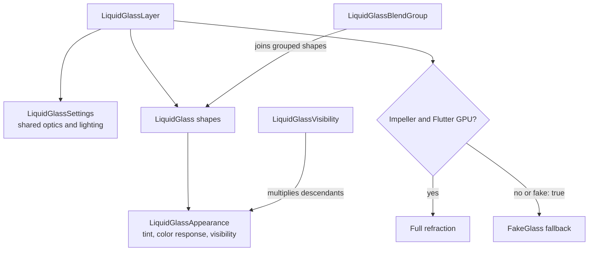

# Renderer review notes

How the renderer's parts relate, the invariants its tests hold it to, and
which tests need a real GPU.

## API ownership


```mermaid
flowchart TD
  L[LiquidGlassLayer] --> S[LiquidGlassSettings
  shared optics and lighting]
  L --> G[LiquidGlass shapes]
  G --> A[LiquidGlassAppearance
  tint, color response, visibility]
  V[LiquidGlassVisibility] -->|multiplies descendants| A
  B[LiquidGlassBlendGroup] -->|joins grouped shapes| G
  L --> R{Impeller and Flutter GPU?}
  R -->|yes| Real[Full refraction]
  R -->|no or fake: true| Fake[FakeGlass fallback]
```

## Invariants

- Submitted real-glass filters own their coordinate uniforms. A later scroll
  cannot overwrite coordinates used by an older native frame.
- A geometry or contributor texture is never written while a submitted scene
  can still sample it: each output cycles through a ring of textures and
  rewrites one only a frame after it was replaced
  (`test/src/geometry_texture_reuse_test.dart`). Unchanged or translated
  geometry keeps its matte.
- The fake-glass tracker is submitted before its effect, exactly once.
- Uniform ancestor motion reuses geometry without repainting the render object.
- Nested ungrouped glass gets an ordered material pass, including the implicit
  `Layer -> Glass -> Glass` case. Siblings can still share a pass.
- Common ancestor clips stay in their own coordinate spaces as glass scrolls
  through them. Independent sibling clip batching is not implemented.
- Uniform layers do not allocate the per-shape contributor texture, and
  per-shape appearance adds no backdrop capture or blur pass.
- A fully invisible layer releases its backdrop filter.
- Real and fake glass preserve the same foreground order.

## Tests

From the repository root with Flutter 3.47.1:

```sh
melos analyze
melos test
```

The submitted-scene tests capture the first native frame, avoiding an extra
repaint-boundary traversal that could refresh retained state. They also retain
a native scene across a later scroll and assert unchanged pixels. Permutation
tests compare moved output with an independently laid-out static destination.
`expanding_blend_frame_test.dart` keeps the collapsed bottom-bar scene across
eight resize updates, growing and shrinking, and checks the stationary right
button in real and fake modes with uniform and per-shape materials, plus a
static reference golden. `example/test/scroll_frame_tracking_test.dart` checks
that real and fake glass track every submitted scroll frame.

### What `flutter_tester` cannot run

`flutter_tester` (on Linux and macOS alike) mis-renders some sequences that
Metal and Vulkan render correctly:

- It renders only the first subpass that contains a `BackdropFilter` per
  process; later ones are black. The `LiquidGlassCapture` pixel tests
  therefore live one scene per file and render the captured scene first.
- It rasterizes the first fractional frame after a fully transparent one
  wrong, including content outside the glass. The outer optical fade, seeded
  nested fade and real/fake opacity cases skip under `flutter_tester`
  (`SubmittedSceneCapture.isFlutterTester`) and run on a device.
- It rasterizes differently on every host, so golden comparisons run on macOS
  only, against references rendered by `flutter test --update-goldens` on the
  CI golden job's image (`macos-26`). Elsewhere the tests keep their other
  checks.
- An intermittent native `flutter_tester`/SwiftShader crash remains.

### Device suites

`integration_test/liquid_glass_capture_test.dart` runs every capture scene,
the fake references under a fade, and dispose/recreate on a real GPU:

```sh
flutter test --enable-impeller -d macos \
  integration_test/liquid_glass_capture_test.dart
```

The other device suites install a `SubmittedSceneCapture` binding, which
`flutter test -d macos` rejects because it initializes
`IntegrationTestWidgetsFlutterBinding` before `main`. Run those through
`flutter drive`, which leaves binding setup to the test:

```sh
flutter drive --enable-impeller -d macos \
  --driver=test_driver/backdrop_seed_driver.dart \
  --target=integration_test/independent_opacity_paint_order_test.dart
```

For device benchmarks, follow [README.md](README.md). The example also
supports `LIQUID_GLASS_EXAMPLE_PERFORMANCE_PROBE=true`; separate startup from
steady scroll windows and do not infer comparative performance from video
alone.
